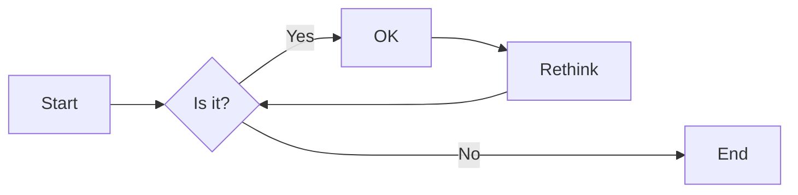
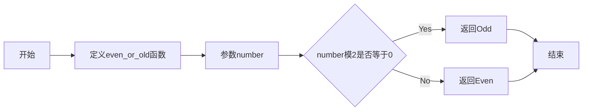

# 实验二 Python变量、简单数据类型

班级： 21计科2班

学号： B20210302219

姓名： 罗天爱

Github地址：<https://github.com/linaliaa/pythonlianxi>

CodeWars地址：<https://www.codewars.com/users/linaliaa>

---

## 实验目的

1. 使用VSCode编写和运行Python程序
2. 学习Python变量和简单数据类型

## 实验环境

1. Git
2. Python 3.10
3. VSCode
4. VSCode插件

## 实验内容和步骤

### 第一部分

实验环境的安装

1. 安装Python，从Python官网下载Python 3.10安装包，下载后直接点击可以安装：[Python官网地址](https://www.python.org/downloads/)
2. 为了在VSCode集成环境下编写和运行Python程序，安装下列VScode插件
   - Python
   - Python Environment Manager
   - Python Indent
   - Python Extended
   - Python Docstring Generator
   - Jupyter
   - indent-rainbow
   - Jinja

---

### 第二部分

Python变量、简单数据类型和列表简介

完成教材《Python编程从入门到实践》下列章节的练习：

- 第2章 变量和简单数据类型

---

### 第三部分

在[Codewars网站](https://www.codewars.com)注册账号，完成下列Kata挑战：

---

#### 第1题：求离整数n最近的平方数（Find Nearest square number）

难度：8kyu

你的任务是找到一个正整数n的最近的平方数
例如，如果n=111，那么nearest_sq(n)（nearestSq(n)）等于121，因为111比100（10的平方）更接近121（11的平方）。
如果n已经是完全平方（例如n=144，n=81，等等），你需要直接返回n。
代码提交地址
<https://www.codewars.com/kata/5a805d8cafa10f8b930005ba>

---

#### 第2题：弹跳的球（Bouncing Balls）

难度：6kyu

一个孩子在一栋高楼的第N层玩球。这层楼离地面的高度h是已知的。他把球从窗口扔出去。球弹了起来,  例如:弹到其高度的三分之二（弹力为0.66）。他的母亲从离地面w米的窗户向外看,母亲会看到球在她的窗前经过多少次（包括球下落和反弹的时候）？

一个有效的实验必须满足三个条件：

- 参数 "h"（米）必须大于0
- 参数 "bounce "必须大于0且小于1
- 参数 “window "必须小于h。

如果以上三个条件都满足，返回一个正整数，否则返回-1。
**注意:只有当反弹球的高度严格大于窗口参数时，才能看到球。**
代码提交地址
<https://www.codewars.com/kata/5544c7a5cb454edb3c000047/train/python>

---

#### 第3题： 元音统计(Vowel Count)

难度： 7kyu

返回给定字符串中元音的数量（计数）。对于这个Kata，我们将考虑a、e、i、o、u作为元音（但不包括y）。输入的字符串将只由小写字母和/或空格组成。

代码提交地址：
<https://www.codewars.com/kata/54ff3102c1bad923760001f3>

---

#### 第4题：偶数或者奇数（Even or Odd）

难度：8kyu

创建一个函数接收一个整数作为参数，当整数为偶数时返回”Even”当整数位奇数时返回”Odd”。
代码提交地址：
<https://www.codewars.com/kata/53da3dbb4a5168369a0000fe>

### 第四部分

使用Mermaid绘制程序流程图

安装Mermaid的VSCode插件：

- Markdown Preview Mermaid Support
- Mermaid Markdown Syntax Highlighting

使用Markdown语法绘制你的程序绘制程序流程图（至少一个），Markdown代码如下：


显示效果如下：



查看Mermaid流程图语法-->[点击这里](https://mermaid.js.org/syntax/flowchart.html)

使用Markdown编辑器（例如VScode）编写本次实验的实验报告，包括[实验过程与结果](#实验过程与结果)、[实验考查](#实验考查)和[实验总结](#实验总结)，并将其导出为 **PDF格式** 来提交。

## 实验过程与结果

请将实验过程与结果放在这里，包括：

- [第二部分 Python变量、简单数据类型和列表简介](#第二部分)

#### 练习2.1：简单消息

```python
message="hello python world!"
print(message)
```

#### 练习2.2：多条简单消息

```python
message="hello python!"
print(message)

message="hello python world!"
print(message)
```

#### 练习2.3：个性化消息

```python
name = "Eric"
message=f"Hello {name},would you like to learn some Python today?"
print(message)
```

#### 练习2.4：调整名字的大小写

```python
name = "Marius Ali"
print(name.upper())
print(name.lower())
```

#### 练习2.5：名言1

```python
saying = 'William Shakespeare once said,"The night is long that never finds the day."'
print(saying)
```

#### 练习2.6：名言2

```python
famous_person = "William shakespeare"
message = famous_person + ' ' + 'once said,"The night is long that never finds the day."'
print(message)
```

#### 练习2.7：删除人名中的空白

```python
name = " Marius Ali "
print('\t'+name.lstrip()+'\n\n')
print('\t'+name.rstrip()+'\n\n')
print('\t'+name.strip()+'\n\n')
```

### 练习2.8：文件扩展名

```python
filename = 'python_notes.txt'
filename.removesuffix(".txt")
```

### 练习2.9：数字8

```python
print(5+3)
print(9-1)
print(2*4)
print(16/2)
```

### 练习2.10：最喜欢的数

```python
a = 6
message = "我最喜欢的数是"+str(a)+'。'
print(message)
```

### 练习2.11：添加注释

```python
#大家好
print（“Hello everyone”）
```

### 练习2.12：Python之禅

```python
①win+r 打开运行窗口
②输入cmd打开命令提示符
③输入python进入cpython
④输入import this
Beautiful is better than ugly.
Explicit is better than implicit.
Simple is better than complex.
Complex is better than complicated.
Flat is better than nested.
Sparse is better than dense.
Readability counts.
Special cases aren't special enough to break the rules.
Although practicality beats purity.
Errors should never pass silently.
Unless explicitly silenced.
In the face of ambiguity, refuse the temptation to guess.
There should be one-- and preferably only one --obvious way to do it.
Although that way may not be obvious at first unless you're Dutch.
Now is better than never.
Although never is often better than *right* now.
If the implementation is hard to explain, it's a bad idea.
If the implementation is easy to explain, it may be a good idea.
Namespaces are one honking great idea -- let's do more of those!
#这个没看懂，是在网上搜索的。
```

- [第三部分 Codewars Kata挑战](#第三部分)

第1题：求离整数n最近的平方数（Find Nearest square number）

你的任务是找到一个正整数n的最近的平方数
例如，如果n=111，那么nearest_sq(n)（nearestSq(n)）等于121，因为111比100（10的平方）更接近121（11的平方）。如果n已经是完全平方（例如n=144，n=81，等等），你需要直接返回n。

答：

```python
import math

def nearest_sq(n):
    sqrt_n = math.isqrt(n)
    
    lower_square = sqrt_n ** 2
    upper_square = (sqrt_n + 1) ** 2
    
    if abs(n - lower_square) <= abs(n - upper_square):
        return lower_square
    else:
        return upper_square
```

第2题：弹跳的球（Bouncing Balls）

一个孩子在一栋高楼的第N层玩球。这层楼离地面的高度h是已知的。他把球从窗口扔出去。球弹了起来,  例如:弹到其高度的三分之二（弹力为0.66）。他的母亲从离地面w米的窗户向外看,母亲会看到球在她的窗前经过多少次（包括球下落和反弹的时候）？一个有效的实验必须满足三个条件：

- 参数 "h"（米）必须大于0
- 参数 "bounce "必须大于0且小于1
- 参数 “window "必须小于h。

如果以上三个条件都满足，返回一个正整数，否则返回-1。

答：

```python
def bouncing_ball(h, bounce, window):
    if not (h > 0 and 0 < bounce < 1 and window < h):
        return -1
    
    passes = 0
    
    while h > window:
        passes += 1
        h *= bounce
        
        if h > window:
            passes += 1
    return passes
```

第3题： 元音统计(Vowel Count)

返回给定字符串中元音的数量（计数）。对于这个Kata，我们将考虑a、e、i、o、u作为元音（但不包括y）。输入的字符串将只由小写字母和/或空格组成。

答：

```python
def get_count(sentence): 
    vowels = {'a', 'e', 'i', 'o', 'u'}
    count = 0
    for char in sentence:
        if char in vowels:
            count += 1
    return count
```

第4题：偶数或者奇数（Even or Odd）

创建一个函数接收一个整数作为参数，当整数为偶数时返回”Even”当整数位奇数时返回”Odd”。

答：

```python
def even_or_odd(number):
    if number % 2 == 0:
        return "Even"
    else:
        return "Odd"
```

- [第四部分 使用Mermaid绘制程序流程图](#第四部分)

偶数或奇数流程图代码：



**注意：不要使用截图，Markdown文档转换为Pdf格式后，截图可能会无法显示。**

## 实验考查

请使用自己的语言并使用尽量简短代码示例回答下面的问题，这些问题将在实验检查时用于提问和答辩以及实际的操作。

1. Python中的简单数据类型有那些？我们可以对这些数据类型做哪些操作？
答：简单的数据类型有：整数，浮点数，字符类型，逻辑类型等；可以对这些数据类型进行加减乘除运算，逻辑运算，比较运算。

2. 为什么说Python中的变量都是标签？
答：因为python的赋值语句实际上是先在内存空间中找到一片区域，再把变量作为一个标签贴在这一片区域上。变量常被描述为可用于存储的盒子。变量指向特定的值。

3. 有哪些方法可以提高Python代码的可读性？
答：1.代码的布局，2.空格的使用，3.代码注释，4.命名规范。

## 实验总结

总结一下这次实验你学习和使用到的知识，例如：编程工具的使用、数据结构、程序语言的语法、算法、编程技巧、编程思想。

答：在这次实验的学习过程中，学习到了python程序中会使用到的各种数据类型，并学会如何在程序中使用变量来表示这些数据类型。

完成codewars kata挑战，加强了对python的实际应用。

画流程图遇到了一些问题，寻求了同学的帮助，英语基础有点不好，有些东西看不懂。不过最终还是完美解决，这次的实验让我对python的掌握更进一步，接下来的学习会继续努力。
