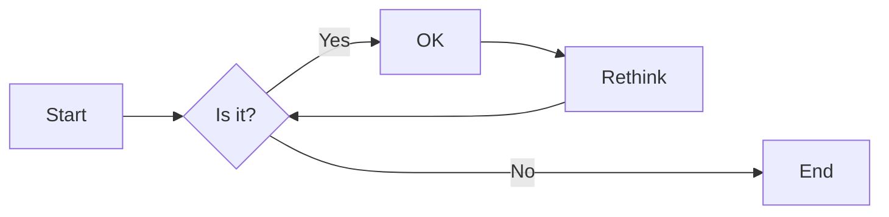
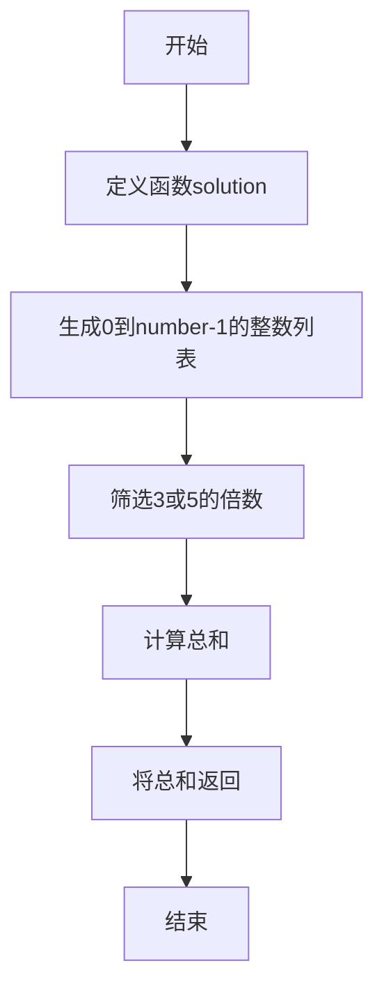
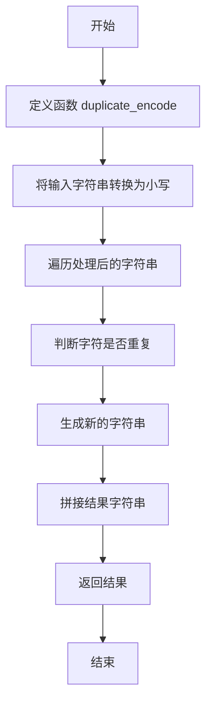
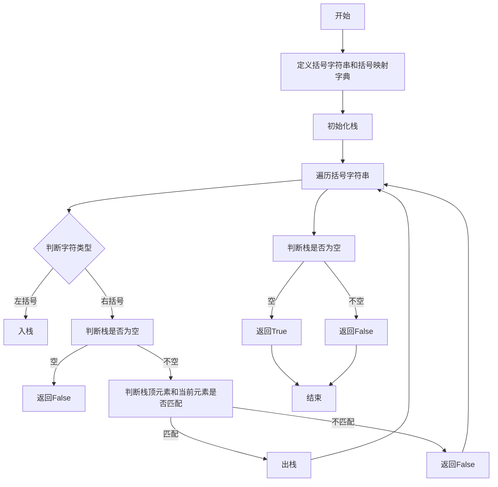
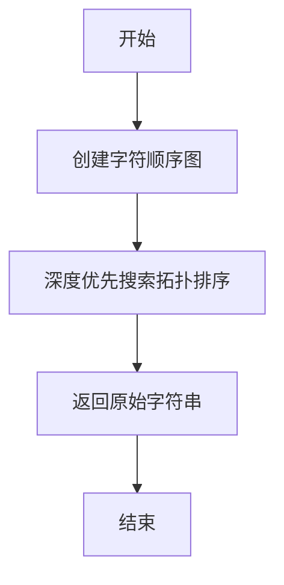
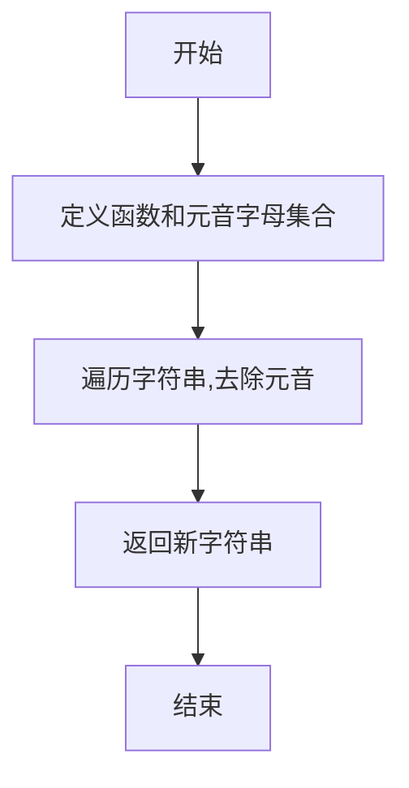

# 实验三 Python列表

班级： 21计科02

学号： 20210302219

姓名： 罗天爱

Github地址：<https://github.com/linaliaa/lian_xi_2>

CodeWars地址：<https://www.codewars.com/users/linaliaa>

---

## 实验目的

1. 学习Python的简单使用和列表操作
2. 学习Python中的if语句

## 实验环境

1. Git
2. Python 3.10
3. VSCode
4. VSCode插件

## 实验内容和步骤

### 第一部分

Python列表操作

完成教材《Python编程从入门到实践》下列章节的练习：

- 第3章 列表简介
- 第4章 操作列表
- 第5章 if语句

---

### 第二部分

在[Codewars网站](https://www.codewars.com)注册账号，完成下列Kata挑战：

---

#### 第一题：3和5的倍数（Multiples of 3 or 5）

难度： 6kyu

如果我们列出所有低于 10 的 3 或 5 倍数的自然数，我们得到 3、5、6 和 9。这些数的总和为 23. 完成一个函数，使其返回小于某个整数的所有是3 或 5 的倍数的数的总和。此外，如果数字为负数，则返回 0。

注意：如果一个数同时是3和5的倍数，应该只被算一次。

**提示：首先使用列表解析得到一个列表，元素全部是3或者5的倍数。
使用sum函数可以获取这个列表所有元素的和.**

代码提交地址：
<https://www.codewars.com/kata/514b92a657cdc65150000006>

---

#### 第二题： 重复字符的编码器（Duplicate Encoder）

难度： 6kyu

本练习的目的是将一个字符串转换为一个新的字符串，如果新字符串中的每个字符在原字符串中只出现一次，则为"("，如果该字符在原字符串中出现多次，则为")"。在判断一个字符是否是重复的时候，请忽略大写字母。

例如:

```python
"din"      =>  "((("
"recede"   =>  "()()()"
"Success"  =>  ")())())"
"(( @"     =>  "))(("
```

代码提交地址:
<https://www.codewars.com/kata/54b42f9314d9229fd6000d9c>

---

#### 第三题：括号匹配（Valid Braces）

难度：6kyu

写一个函数，接收一串括号，并确定括号的顺序是否有效。如果字符串是有效的，它应该返回True，如果是无效的，它应该返回False。
例如：

```python
"(){}[]" => True 
"([{}])" => True
 "(}" => False
 "[(])" => False 
"[({})](]" => False
```

**提示：
python中没有内置堆栈数据结构，可以直接使用`list`来作为堆栈，其中`append`方法用于入栈，`pop`方法可以出栈。**

代码提交地址
<https://www.codewars.com/kata/5277c8a221e209d3f6000b56>

---

#### 第四题： 从随机三元组中恢复秘密字符串(Recover a secret string from random triplets)

难度： 4kyu

有一个不为你所知的秘密字符串。给出一个随机三个字母的组合的集合，恢复原来的字符串。

这里的三个字母的组合被定义为三个字母的序列，每个字母在给定的字符串中出现在下一个字母之前。"whi "是字符串 "whatisup "的一个三个字母的组合。

作为一种简化，你可以假设没有一个字母在秘密字符串中出现超过一次。

对于给你的三个字母的组合，除了它们是有效的三个字母的组合以及它们包含足够的信息来推导出原始字符串之外，你可以不做任何假设。特别是，这意味着秘密字符串永远不会包含不出现在给你的三个字母的组合中的字母。

测试用例：

```python
secret = "whatisup"
triplets = [
  ['t','u','p'],
  ['w','h','i'],
  ['t','s','u'],
  ['a','t','s'],
  ['h','a','p'],
  ['t','i','s'],
  ['w','h','s']
]
test.assert_equals(recoverSecret(triplets), secret)
```

代码提交地址：
<https://www.codewars.com/kata/53f40dff5f9d31b813000774/train/python>

提示：

- 利用集合去掉`triplets`中的重复字母，得到字母集合`letters`，最后的`secret`应该由集合中的字母组成，`secret`长度也等于该集合。

```python
letters = {letter for triplet in triplets for letter in triplet }
length = len(letters)
```

- 创建函数`check_first_letter(triplets, first_letter)`，检测一个字母是不是secret的首字母，返回True或者False。
- 创建函数`remove_first_letter(triplets, first_letter)`,  从三元组中去掉首字母，返回新的三元组。
- 遍历字母集合letters，利用上面2个函数得到最后的结果`secret`。

---

#### 第五题： 去掉喷子的元音（Disemvowel Trolls）

难度： 7kyu

喷子正在攻击你的评论区!
处理这种情况的一个常见方法是删除喷子评论中的所有元音(字母：a,e,i,o,u)，以消除威胁。
你的任务是写一个函数，接收一个字符串并返回一个去除所有元音的新字符串。
例如，字符串 "This website is for losers LOL!"   将变成 "Ths wbst s fr lsrs LL!".

注意：对于这个Kata来说，y不被认为是元音。
代码提交地址：
<https://www.codewars.com/kata/52fba66badcd10859f00097e>

提示：

- 首先使用列表解析得到一个列表，列表中所有不是元音的字母。
- 使用字符串的join方法连结列表中所有的字母，例如：

```python
last_name = "lovelace"
letters = [letter for letter in last_name ]
print(letters) # ['l', 'o', 'v', 'e', 'l', 'a', 'c', 'e']
name = ''.join(letters) # name = "lovelace"
```

---

### 第三部分

使用Mermaid绘制程序流程图

安装VSCode插件：

- Markdown Preview Mermaid Support
- Mermaid Markdown Syntax Highlighting

使用Markdown语法绘制你的程序绘制程序流程图（至少一个），Markdown代码如下：


显示效果如下：



查看Mermaid流程图语法-->[点击这里](https://mermaid.js.org/syntax/flowchart.html)

使用Markdown编辑器（例如VScode）编写本次实验的实验报告，包括[实验过程与结果](#实验过程与结果)、[实验考查](#实验考查)和[实验总结](#实验总结)，并将其导出为 **PDF格式** 来提交。

## 实验过程与结果

请将实验过程与结果放在这里，包括：

- [第一部分 Python列表操作和if语句](#第一部分)

### 练习3.1：姓名

```python
names = ['张三','李四','王五']
print(names[0])
print(names[1])
print(names[2])
```

### 练习3.2：问候语

```python
names = ['张三','李四','王五']
print(names[0]+',你好!')
print(names[1]+',你好!')
print(names[2]+',你好!')
```

### 练习3.3：自己的列表

```python
travel=['小汽车','自行车','摩托车']
print('我想拥有一辆：'+travel[0])
print('我想拥有一辆：'+travel[1])
print('我想拥有一辆：'+travel[2])
```

### 练习3.4：嘉宾名单

```python
list['Marius','Ali','Mhy']
for name in list:
    print('尊敬的：'+name+'(先生/女士)，诚邀您与我共进晚餐!')
```

### 练习3.5：修改嘉宾名单

```python
list['Marius','Ali','Mhy']
print(list[2]+'因故无法赴约')
list[2]='jack'
for name in list:
    print('尊敬的：'+name+'(先生/女士)，诚邀您与我共进晚餐!')
```

### 练习3.6：添加嘉宾

```python
list['Marius','Ali','Mhy']
list.insert(0,'A')
list.insert(2,'B')
list.append('C')
for name in list:
    print('尊敬的：'+name+'(先生/女士)，诚邀您与我共进晚餐!')
```

### 练习3.7：缩短名单

```python
list['Marius','Ali','Mhy']
list.insert(0,'A')
list.insert(2,'B')
list.append('C')
for name in list:
    print('尊敬的：'+name+'(先生/女士)，诚邀您与我共进晚餐!')
print('抱歉，只能邀请两位嘉宾共进晚餐')
n = int(len(list))
while n>2:
    lname=list.pop()
    print(lname+',抱歉，无法邀请您共进晚餐')
    n=n-1
for name in list:
    print(name+'您依然在受邀之列')
del list[0]
del list[1]
for name in list:
    print(name)
```

### 练习3.8：放眼世界

```python
traver_place = ['BeiJing','NanJing','XiAn','Florence','HangZhou']
print(traver_place)
print(sorted(traver_place))
print(traver_place)
traver_place.reverse()
print(sorted(traver_place))
print(traver_place)
traver_place.reverse()
print(traver_place)
traver_place.reverse()
print(traver_place)
traver_place.sort()
print(traver_place)
traver_place.sort(reverse=True)
print(traver_place)
```

### 练习3.9：晚餐嘉宾

```python
list['Marius','Ali','Mhy']
print('一共邀请了：'+str(len(list))+'位嘉宾！')
```

### 练习4.1：比萨

```python
pizza={'A','B','C'}
for temp in pizzas:
  print(temp)
for temp2 in pizzas:
  print('I like:'+temp2+'!')
print('我爱吃比萨'+str(pizzas)+',I really love pizza!')
```

### 练习4.2：动物

```python
animals = ['dog','cat','bird']
for temp in animals:
  print(temp)
  print('A '+ animals[0] + ' would make a great pet')
  print('A '+ animals[1] + ' would make a great pet')
  print('A '+ animals[2] + ' would make a great pet')
  print('Any of these animals would make a great pet!')
```

### 练习4.3：数到20

```python
for value in range(1,21):
  print(value)
```

### 练习4.4：100万

```python
numders=list(range(1,1000001))
for value in numbers:
  print(value)
```

### 练习4.5：100万求和

```python
numders=list(range(1,1000001))
print(min(numbers))
print(max(numbers))
print(sum(numbers))
```

### 练习4.6：奇数

```python
numbers=list(range(1,21,2))
for value in numbers:
  print(value)
```

### 练习4.7：3的倍数

```python
number1=list(range(3,31))
number2=[]
for n in number1:
  if n%3==0:
    number2.append(n)
print(number2)
```

### 练习4.8：立方

```python
for value in range(3,31,3):
  print(value)
```

### 练习4.9：立方推导式

```python
list=[value**3 for value in range(1,11)]
print(list)
```

### 练习4.10：切片

```python
lists = ['1','2','3','4','5','6','7']
print('The first three items in the list are:')
temp1 = lists[:3]
for t1 in temp1:
  print(t1)
  print('Three items fromthe middle of the list are:' )
  temp2 = lists[2:5]
  for t2 in temp2:
    print(t2)
    print('Three items fromthe middle of the list are:')
    temp3 = lists[-3:]
    for t3 in temp3:
      print(t3)
```

### 练习4.11：你的比萨，我的比萨

```python
my_pizza={'A','B','C'}
friend_pizzas=my_pizzas[:]
my_pizzas.append('my_D')
friend_pizzas.append(friend_D')
print('My favorite pizzas are：')
for temp in my_pizzas:
  print(temp)
  print("My friend\'s favorite pizzas are：')
for temp in friend_pizzas:
  print(temp)
```

### 练习4.12：使用多个循环

```python
my_foods=['pizza','falafel','carrot cake']
for t in my_foods:
  print(t)
```

### 练习4.13：自助餐

```python
food=('青菜','牛肉','番茄炒蛋','香蕉','葡萄')
for f in food:
  print(f)
food[0]='1'
food=('1','2','番茄炒蛋','香蕉','葡萄')
for f in food:
  print(f)
```

### 练习5.1：条件测试

```python
car='A'
cars=['A','B']
print(car=='A') #Ture
print(car!='A') #False
print(car==car) #Ture
print(car==car.title()) #False
print(car=='A' or car=='B') #Ture
print(car=='A' and car=='B') #False
print(int(len(car))==int(len('A'))) #Ture
print(int(len(car))==int(len('B'))) #False
print('A' in cars) #Ture
print('B' not in cars) #False
```

#### 练习5.2：更多的条件测试

```python
name1='lali'
name3='LALi'
print(name1==name2) #False
print(name1==name2.lower()) #True
 
n1=6
n2=7
print(n1==n2) #False
print(n!=n2) #True
print(n1>n2) #False
print(n1<n2) #True

if n1>6 and n2>6:
    print("True")
else:
    print("False")
if n1>6 or n2>6:
    print("True")
else:
    print("False")
 
names=['luo', 'wang', 'li', 'zhang']
name='zhao'
 
if name in names:
    print(name + "in")
else:
    print(name + "not in")
```

#### 5.3：外星人颜色1

```python
alien_color = 'yellow'
 
if alien_color == 'green':
    print("You got 5 point")
else:
    print(" ")
```

#### 5.4：外星人颜色2

```python
alien_color = 'yellow'

if alien_color == 'green':
    print("You got 5 point")
else:
    print("You got 10 point")
```

#### 5.5：外星人颜色3

```python
alien_color = 'yellow'
 
if alien_color == 'green':
    print("You got 5 point")
elif alien_color == 'yellow':
    print("You got 10 point")
else:
    print("You got 15 point")
```

#### 5.6：人生的不同阶段

```python
age = 21
 
if age < 2:
    print("baby")
elif 2 <= age < 4:
    print("child")
elif 4 <= age < 13:
    print("children")
elif 13 <= age < 20:
    print("teenagers")
elif 20 <= age < 65:
    print("adult")
else:
    print("The elderly")
```

#### 5.7：喜欢的水果

```python
favorite_fruits = ['peach', 'apple', 'banana']
 
if "apple" in favorite_fruits:
    print("You really like apple!")
if "orange" in favorite_fruits:
    print("You really like orange!")
if "peach" in favorite_fruits:
    print("You really like peach!")
if "pear" in favorite_fruits:
    print("You really like pear!")
else:
    print("The fruit not list")
```

#### 5.8：以特殊方式跟管理员打招呼

```python
names = ['admin', 'A', 'B', 'C', 'D']
for name in user_names:
    if name == 'admin':
        print("Hello admin, would you like to see a status report?")
    else:
        print("Hello Jaden, thank you for logging in again")
```

#### 5.9：处理没有用户的情形

```python
names = ['admin', 'A', 'B', 'C', 'D']
for name in user_names:
    if name == '':
        print("We need to find some users!")
```

#### 5.10：检查用户名

```python
current_users = ['admin', 'A', 'B', 'C', 'D']
new_users = ['admin', 'B', 'E', 'F', 'G']
new_current_users = []
 
for current_user in current_users:
    new_current_users.append(current_user.lower())
 
for new_user in new_users:
    if new_user.lower() in new_current_users:
        print("用户名: %s 已被使用，请重新输入" % new_user)
    else:
        print("Welcome \n" + new_user)
```

#### 5.11：序数

```python
nums = ['1', '2', '3', '4', '5', '6', '7', '8', '9']
for n in nums:
    if n == "1":
        print("1st")
    elif n == "2":
        print("2nd")
    elif n == "3":
        print("3rd")
    else:
        print(n + "th")
```

- [第二部分 Codewars Kata挑战](#第二部分)

#### 第一题：3和5的倍数

如果我们列出所有低于 10 的 3 或 5 倍数的自然数，我们得到 3、5、6 和 9。这些数的总和为 23. 完成一个函数，使其返回小于某个整数的所有是3 或 5 的倍数的数的总和。此外，如果数字为负数，则返回 0。注意：如果一个数同时是3和5的倍数，应该只被算一次。
s
```python
def solution(number):
    numbers = [i for i in range(number)]
    s =  [i for i in range(number) if i%3==0 or i%5==0]
    return sum(s) 
```

#### 第二题：重复字符的编码器

本练习的目的是将一个字符串转换为一个新的字符串，如果新字符串中的每个字符在原字符串中只出现一次，则为"("，如果该字符在原字符串中出现多次，则为")"。在判断一个字符是否是重复的时候，请忽略大写字母。

```python
def duplicate_encode(word):
    k = []
    word = word.lower()
    for c in word:
        if word.count(c) > 1:
            k.append(')')
        else:
            k.append('(') 
    return ''.join(k)
```

#### 第三题：括号匹配

写一个函数，接收一串括号，并确定括号的顺序是否有效。如果字符串是有效的，它应该返回True，如果是无效的，它应该返回False。

```python
braces = "(){}[]" #括号字符串
dict_braces = {'}': '{', ']': '[', ')': '('}

def validBraces(string):
    stack = []
    for c in string:
        if c in '({[':
            stack.append(c)
        elif c in ')}]':
            if not stack:
                return False
            if stack[-1] != dict_braces[c]:
                return False
            else:
                stack.pop()
    if not stack:
        return True
    else:
        return False
```

不是很会，在他人帮助下做出来的。

#### 第四题：从随机三元组中恢复秘密字符串

有一个不为你所知的秘密字符串。给出一个随机三个字母的组合的集合，恢复原来的字符串。
这里的三个字母的组合被定义为三个字母的序列，每个字母在给定的字符串中出现在下一个字母之前。"whi "是字符串 "whatisup "的一个三个字母的组合。
作为一种简化，你可以假设没有一个字母在秘密字符串中出现超过一次。
对于给你的三个字母的组合，除了它们是有效的三个字母的组合以及它们包含足够的信息来推导出原始字符串之外，你可以不做任何假设。特别是，这意味着秘密字符串永远不会包含不出现在给你的三个字母的组合中的字母。

```python
def recoverSecret(triplets):
    m = {}
    for triplet in triplets:
        for char in triplet:
            if char not in m:
                m[char] = set()
        m[triplet[0]].add(triplet[1])
        m[triplet[1]].add(triplet[2])
    visited = set()
    result = []
    def dfs(n):
        if n not in visited:
            visited.add(n)
            for neighbor in m[n]:
                dfs(neighbor)
            result.append(n)
    for n in m:
        dfs(n)
    return ''.join(result[::-1]) #返回原始字符串
```

#### 第五题：去掉喷子的元音

喷子正在攻击你的评论区!
处理这种情况的一个常见方法是删除喷子评论中的所有元音(字母：a,e,i,o,u)，以消除威胁。
你的任务是写一个函数，接收一个字符串并返回一个去除所有元音的新字符串。
例如，字符串 "This website is for losers LOL!"   将变成 "Ths wbst s fr lsrs LL!".
注意：对于这个Kata来说，y不被认为是元音。

```python
def disemvowel(string_):
    vowels = ['a', 'e', 'i', 'o', 'u', 'A', 'E', 'I', 'O', 'U']  
    result = ''  
    for char in string_:  
        if char.lower() not in vowels:  
            result += char  
    return result
```

- [第三部分 使用Mermaid绘制程序流程图](#第三部分)

#### 第一题：3和5的倍数流程图



#### 第二题：重复字符的编码器流程图



#### 第三题：括号匹配流程图



#### 第四题：从随机三元组中恢复秘密字符串流程图



#### 第五题：去掉喷子的元音流程图



## 实验考查

请使用自己的语言并使用尽量简短代码示例回答下面的问题，这些问题将在实验检查时用于提问和答辩以及实际的操作。

1. Python中的列表可以进行哪些操作？
答：可以添加元素、删除元素、查询元素、修改元素、遍历列表、列表排序（临时排序，永久排序）、列表切片、确定列表长度、反向打印列表、列表合并、列表推导式等。

2. 哪两种方法可以用来对Python的列表排序？这两种方法有和区别？
答：可以用sort()方法对列表进行永久排序，用sorted()函数对列表进行临时排序。
sort()方法能永久的修改列表元素的排列顺序，用sorted()函数，列表元素的排列顺序并没有改变。

3. 如何将Python列表逆序打印？
答：要反转列表元素的排列顺序，可以使用reverse()方法。reverse()方法会永久的修改列表的元素顺序，但可随时恢复到原来的排列顺序，只需要对列表再次调用renerse()即可。

4. Python中的列表执行哪些操作时效率比较高？哪些操作效率比较差？是否有类似的数据结构可以用来替代列表？
答：添加和删除元素，随机访问，迭代，长度变化，某些排序操作等效率比较高。
大量元素查找，改变元素值，频繁的移动元素等操作效率比较差。
可以使用集合，元组等来替代列表。

5. 阅读《Fluent Python》Chapter 2. An Array of Sequence - Tuples Are Not Just Immutable Lists小节（p30-p35）。总结该小节的主要内容。
答：这一小节主要内容介绍了元组和不可变序列的关系。元组是不可变序列的一种，与列表和集合不同。还讲了如何创建以及使用元组。

## 实验总结

总结一下这次实验你学习和使用到的知识，例如：编程工具的使用、数据结构、程序语言的语法、算法、编程技巧、编程思想。

答：这次的实验让我了解到了有关列表的知识，学习了列表是什么以及如何使用列表元素。

动手写了书上的题目，这次题目数量有点多，难度也比以前增加了，codewars上的题目难度也更大了，很多都是寻求了他人的帮助才完成。

还学习了如何遍历整个列表，比如使用for循环遍历列表，还学习了根据缩进来确定程序结构，以及避免一些常见的缩进错误。学习了如何创建简单的数值列表，和可以对数值列表执行的一些操作，然后还学习了如何通过切片来使用列表的一部分以及复制列表，还学习了元组。

我还学习了有关if语句方面的知识，比如编写简单的if语句、if-else语句和if-elsif-else语句。还学习了在使用for循环搞笑处理列表元素时，如何对某些元素进行特殊.处理。

然后在完成实验报告的过程中，我更加熟悉了mermaid的使用方法。

总的来说，这次的实验让我对python有了更深入的了解，接下来还会继续努力学习！
