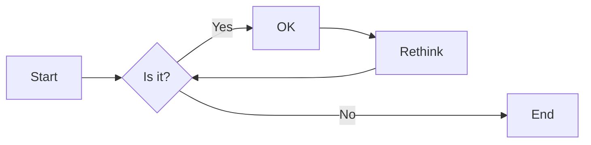
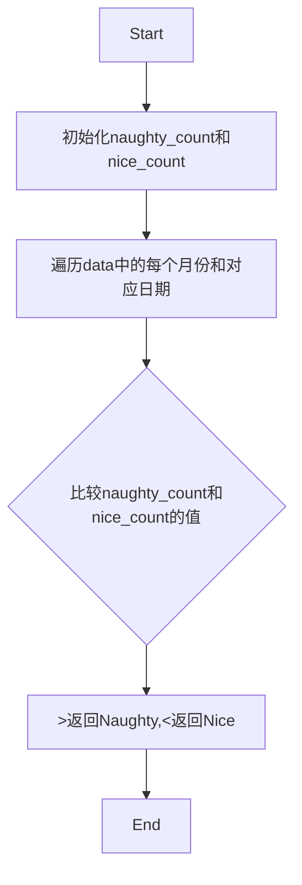
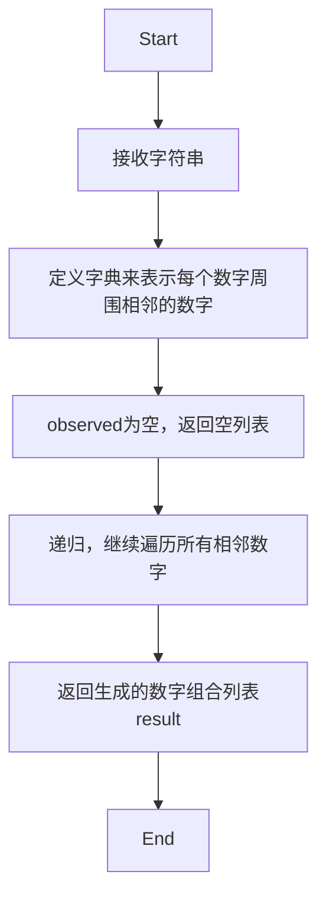
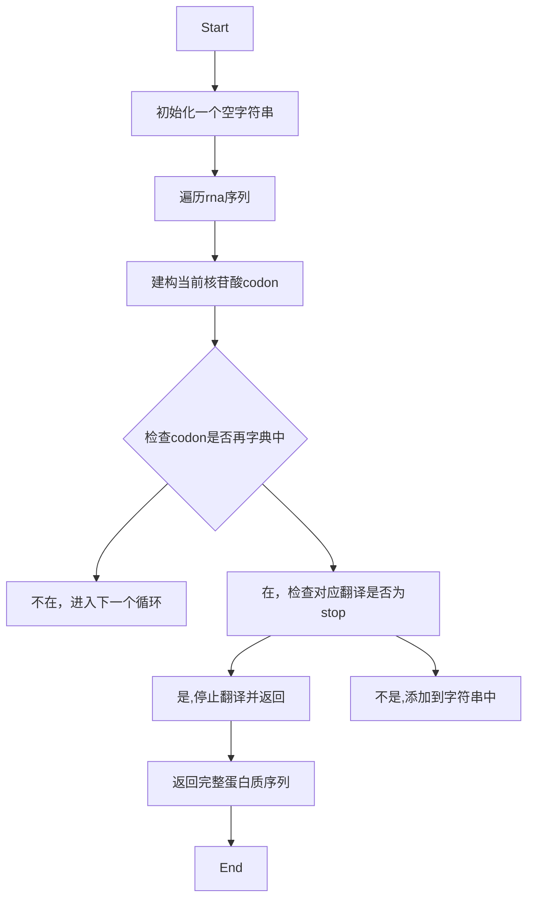
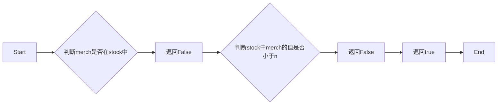
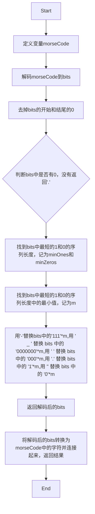

# 实验四 Python字典和while循环

班级： 21计科2

学号： B20210302219

姓名： 罗天爱

Github地址：<https://github.com/linaliaa/lian_xi_2>

CodeWars地址：<https://www.codewars.com/users/linaliaa>

---

## 实验目的

1. 学习Python字典
2. 学习Python用户输入和while循环

## 实验环境

1. Git
2. Python 3.10
3. VSCode
4. VSCode插件

## 实验内容和步骤

### 第一部分

Python列表操作

完成教材《Python编程从入门到实践》下列章节的练习：

- 第6章 字典
- 第7章 用户输入和while循环

---

### 第二部分

在[Codewars网站](https://www.codewars.com)注册账号，完成下列Kata挑战：

---

#### 第一题：淘气还是乖孩子（Naughty or Nice）

难度： 7kyu

圣诞老人要来镇上了，他需要你帮助找出谁是淘气的或善良的。你将会得到一整年的JSON数据，按照这个格式：

```python
{
    January: {
        '1': 'Naughty','2': 'Naughty', ..., '31': 'Nice'
    },
    February: {
        '1': 'Nice','2': 'Naughty', ..., '28': 'Nice'
    },
    ...
    December: {
        '1': 'Nice','2': 'Nice', ..., '31': 'Naughty'
    }
}
```

你的函数应该返回 "Naughty!"或 "Nice!"，这取决于在某一年发生的总次数（以较大者为准）。如果两者相等，则返回 "Nice！"。
代码提交地址：
<https://www.codewars.com/kata/5662b14e0a1fb8320a00005c>

---

#### 第二题： 观察到的PIN（The observed PIN）

难度：4kyu

好了，侦探，我们的一个同事成功地观察到了我们的目标人物，抢劫犯罗比。我们跟踪他到了一个秘密仓库，我们认为在那里可以找到所有被盗的东西。这个仓库的门被一个电子密码锁所保护。不幸的是，我们的间谍不确定他看到的密码，当罗比进入它时。

键盘的布局如下：

```python
┌───┬───┬───┐
│ 1 │ 2 │ 3 │
├───┼───┼───┤
│ 4 │ 5 │ 6 │
├───┼───┼───┤
│ 7 │ 8 │ 9 │
└───┼───┼───┘
    │ 0 │
    └───┘
```

他注意到密码1357，但他也说，他看到的每个数字都有可能是另一个相邻的数字（水平或垂直，但不是对角线）。例如，代替1的也可能是2或4。而不是5，也可能是2、4、6或8。

他还提到，他知道这种锁。你可以无限制地输入错误的密码，但它们最终不会锁定系统或发出警报。这就是为什么我们可以尝试所有可能的（*）变化。

*可能的意义是：观察到的PIN码本身和考虑到相邻数字的所有变化。

你能帮助我们找到所有这些变化吗？如果有一个函数，能够返回一个列表，其中包含一个长度为1到8位的观察到的PIN的所有变化，那就更好了。我们可以把这个函数命名为getPINs（在python中为get_pins，在C#中为GetPINs）。

但请注意，所有的PINs，包括观察到的PINs和结果，都必须是字符串，因为有可能会有领先的 "0"。我们已经为你准备了一些测试案例。
侦探，我们就靠你了!
代码提交地址：
<https://www.codewars.com/kata/5263c6999e0f40dee200059d>

---

#### 第三题： RNA到蛋白质序列的翻译（RNA to Protein Sequence Translation）

难度：6kyu

蛋白质是由DNA转录成RNA，然后转译成蛋白质的中心法则。RNA和DNA一样，是由糖骨架（在这种情况下是核糖）连接在一起的长链核酸。每个由三个碱基组成的片段被称为密码子。称为核糖体的分子机器将RNA密码子转译成氨基酸链，称为多肽链，然后将其折叠成蛋白质。

蛋白质序列可以像DNA和RNA一样很容易地可视化，作为大字符串。重要的是要注意，“停止”密码子不编码特定的氨基酸。它们的唯一功能是停止蛋白质的转译，因此它们不会被纳入多肽链中。“停止”密码子不应出现在最终的蛋白质序列中。为了节省您许多不必要（和乏味）的键入，已为您的氨基酸字典提供了键和值。

给定一个RNA字符串，创建一个将RNA转译为蛋白质序列的函数。注意：测试用例将始终生成有效的字符串。

```python
protein（'UGCGAUGAAUGGGCUCGCUCC'）
```

将返回`CDEWARS`

作为测试用例的一部分是一个真实世界的例子！最后一个示例测试用例对应着一种叫做绿色荧光蛋白的蛋白质，一旦被剪切到另一个生物体的基因组中，像GFP这样的蛋白质可以让生物学家可视化细胞过程！

Amino Acid Dictionary

```python
   # Your dictionary is provided as PROTEIN_DICT
   PROTEIN_DICT = {
    # Phenylalanine
    'UUC': 'F', 'UUU': 'F',
    # Leucine
    'UUA': 'L', 'UUG': 'L', 'CUU': 'L', 'CUC': 'L', 'CUA': 'L', 'CUG': 'L',
    # Isoleucine
    'AUU': 'I', 'AUC': 'I', 'AUA': 'I',
    # Methionine
    'AUG': 'M',
    # Valine
    'GUU': 'V', 'GUC': 'V', 'GUA': 'V', 'GUG': 'V',
    # Serine
    'UCU': 'S', 'UCC': 'S', 'UCA': 'S', 'UCG': 'S', 'AGU': 'S', 'AGC': 'S',
    # Proline
    'CCU': 'P', 'CCC': 'P', 'CCA': 'P', 'CCG': 'P',
    # Threonine
    'ACU': 'T', 'ACC': 'T', 'ACA': 'T', 'ACG': 'T',
    # Alanine
    'GCU': 'A', 'GCC': 'A', 'GCA': 'A', 'GCG': 'A',
    # Tyrosine
    'UAU': 'Y', 'UAC': 'Y',
    # Histidine
    'CAU': 'H', 'CAC': 'H',
    # Glutamine
    'CAA': 'Q', 'CAG': 'Q',
    # Asparagine
    'AAU': 'N', 'AAC': 'N',
    # Lysine
    'AAA': 'K', 'AAG': 'K',
    # Aspartic Acid
    'GAU': 'D', 'GAC': 'D',
    # Glutamic Acid
    'GAA': 'E', 'GAG': 'E',
    # Cystine
    'UGU': 'C', 'UGC': 'C',
    # Tryptophan
    'UGG': 'W',
    # Arginine
    'CGU': 'R', 'CGC': 'R', 'CGA': 'R', 'CGG': 'R', 'AGA': 'R', 'AGG': 'R',
    # Glycine
    'GGU': 'G', 'GGC': 'G', 'GGA': 'G', 'GGG': 'G',
    # Stop codon
    'UAA': 'Stop', 'UGA': 'Stop', 'UAG': 'Stop'
}
```

代码提交地址：
<https://www.codewars.com/kata/555a03f259e2d1788c000077>

---

#### 第四题： 填写订单（Thinkful - Dictionary drills: Order filler）

难度：8kyu

您正在经营一家在线业务，您的一天中很大一部分时间都在处理订单。随着您的销量增加，这项工作占用了更多的时间，不幸的是最近您遇到了一个情况，您接受了一个订单，但无法履行。

您决定写一个名为`fillable()`的函数，它接受三个参数：一个表示您库存的字典`stock`，一个表示客户想要购买的商品的字符串`merch`，以及一个表示他们想购买的商品数量的整数n。如果您有足够的商品库存来完成销售，则函数应返回`True`，否则应返回`False`。

有效的数据将始终被传入，并且n将始终大于等于1。

代码提交地址：
<https://www.codewars.com/kata/586ee462d0982081bf001f07/python>

---

#### 第五题： 莫尔斯码解码器（Decode the Morse code, advanced）

难度： 4kyu

在这个作业中，你需要为有线电报编写一个莫尔斯码解码器。
有线电报通过一个有按键的双线路运行，当按下按键时，会连接线路，可以在远程站点上检测到。莫尔斯码将每个字符的传输编码为"点"（按下按键的短按）和"划"（按下按键的长按）的序列。

在传输莫尔斯码时，国际标准规定：

- "点" - 1个时间单位长。
- "划" - 3个时间单位长。
- 字符内点和划之间的暂停 - 1个时间单位长。
- 单词内字符之间的暂停 - 3个时间单位长。
- 单词间的暂停 - 7个时间单位长。

但是，该标准没有规定"时间单位"有多长。实际上，不同的操作员会以不同的速度进行传输。一个业余人士可能需要几秒钟才能传输一个字符，一位熟练的专业人士可以每分钟传输60个单词，而机器人发射器可能会快得多。

在这个作业中，我们假设消息的接收是由硬件自动执行的，硬件会定期检查线路，如果线路连接（远程站点的按键按下），则记录为1，如果线路未连接（远程按键弹起），则记录为0。消息完全接收后，它会以一个只包含0和1的字符串的形式传递给你进行解码。

例如，消息`HEYJUDE`，即`·····−·−−··−−−··−−··`可以如下接收：

```python
1100110011001100000011000000111111001100111111001111110000000000000011001111110011111100111111000000110011001111110000001111110011001100000011
```

如您所见，根据标准，这个传输完全准确，硬件每个"点"采样了两次。

因此，你的任务是实现两个函数：

函数decodeBits(bits)，应该找出消息的传输速率，正确解码消息为点（.）、划（-）和空格（字符之间有一个空格，单词之间有三个空格），并将它们作为一个字符串返回。请注意，在消息的开头和结尾可能会出现一些额外的0，确保忽略它们。另外，如果你无法分辨特定的1序列是点还是划，请假设它是一个点。

函数decodeMorse(morseCode)，它将接收上一个函数的输出，并返回一个可读的字符串。

注意：出于编码目的，你必须使用ASCII字符.和-，而不是Unicode字符。

莫尔斯码表已经预加载给你了（请查看解决方案设置，以获取在你的语言中使用它的标识符）。

```python
morseCodes(".--")  #to access the morse translation of ".--"
```

下面是Morse码支持的完整字符列表：

```javascript
A    ·–
B    –···
C    –·–·
D    –··
E    ·
F    ··–·
G    ––·
H    ····
I    ··
J    ·–––
K    –·–
L    ·–··
M    ––
N    –·
O    –––
P    ·––·
Q    ––·–
R    ·–·
S    ···
T    –
U    ··–
V    ···–
W    ·––
X    –··–
Y    –·––
Z    ––··
0    –––––
1    ·––––
2    ··–––
3    ···––
4    ····–
5    ·····
6    –····
7    ––···
8    –––··
9    ––––·
.    ·–·–·–
,    ––··––
?    ··––··
'    ·––––·
!    –·–·––
/    –··–·
(    –·––·
)    –·––·–
&    ·–···
:    –––···
;    –·–·–·
=    –···–
+    ·–·–·
-    –····–
_    ··––·–
"    ·–··–·
$    ···–··–
@    ·––·–·
```

代码提交地址：
<https://www.codewars.com/kata/decode-the-morse-code-advanced>

---

### 第三部分

使用Mermaid绘制程序流程图

安装VSCode插件：

- Markdown Preview Mermaid Support
- Mermaid Markdown Syntax Highlighting

使用Markdown语法绘制你的程序绘制程序流程图（至少一个），Markdown代码如下：


显示效果如下：



查看Mermaid流程图语法-->[点击这里](https://mermaid.js.org/syntax/flowchart.html)

使用Markdown编辑器（例如VScode）编写本次实验的实验报告，包括[实验过程与结果](#实验过程与结果)、[实验考查](#实验考查)和[实验总结](#实验总结)，并将其导出为 **PDF格式** 来提交。

## 实验过程与结果

请将实验过程与结果放在这里，包括：

- [第一部分 Python列表操作和if语句](#第一部分)

### 练习6.1：人

```python
Lali={'first_name':'Marius','last_name':'ALi','age':'21','city':'weimingshi'}
print(Lali['first_name'])
print(Lali['last_name'])
print(Lali['age'])
print(Lali['city'])
```

### 练习6.2：喜欢的数字1

```python
shu={'A':'1','B':'2','C':'3','D':'4','E':'5'}
for key,value in shu.items():
    print(key+'最喜欢的数字是：'+value)
```

### 练习6.3：词汇表1

```python
dics={'list':'列表','var':'变量','int':'整型','boolean':'布尔','str':'字符串'}
print('dics[\'list\']'+':' + dics['list'])
print('dics[\'var\']'+':' + dics['var'])
print('dics[\'int\']'+':' + dics['int'])
print('dics[\'boolean\']'+':' + dics['boolean'])
print('dics[\'str\']'+':' + dics['str'])
```

### 练习6.4：词汇表2

```python
dics={'list':'列表','var':'变量','int':'整型','boolean':'布尔','str':'字符串'}
for k,v in dics.items():
    print(k + ':' + v + '\n')
```

### 练习6.5：河流

```python
heliu={'nile':'egypt','changjiang':'China','xiangjiang':'China'}
for r,c in heliu.items():
    print('The '+r+' runs through '+c)
for r in heliu.keys():
    print(r)
for c in heliu.values():
    print(c)
```

### 练习6.6：调查

```python
favorite_languages={
    'jen':'python',
    'sarah':'c',
    'edward':'rust',
    'phil':'python',
    }
lists=['jen','sarah','phil','mmm']
temp=[]
for k in favorite_languages.keys():
    temp.append(k)
    print(temp)
    for s in lists:
        if s in temp:
            print("Thanks")
        else:
            print("Please take our poll!")
```

### 练习6.7：人们

```python
Lali0={'first_name':'Marius0','last_name':'ALi0','age':'20','city':'weimingshi0'}
Lali1={'first_name':'Marius1','last_name':'ALi1','age':'21','city':'weimingshi1'}
Lali2={'first_name':'Marius2','last_name':'ALi2','age':'22','city':'weimingshi3'}
ren=[Lali0,Lali1,Lali2]
for i in ren[:]:
    print(i)
```

### 练习6.8：宠物

```python
dog ={'name':'A','age':'1'}
cat ={'name':'B','age':'2'}
bird ={'name':'C','age':'3'}
pets = [dog,cat,bird]
for p in pets:
    print(p)
```

### 练习6.9：喜欢的地方

```python
favorite_places={'A':'a','B':'b','C':'c'}
for n in favorite_places.items():
    print(n)
```

### 练习6.10：喜欢的数字2

```python
shu={'A':['1','2'],'B':['3','4'],'C':['5','6']}
for key,value in shu.items():
    print(key+'最喜欢的数字是：')
    for value1 in value:
        print(value1)
```

### 练习6.11：城市

```python
cities={'beijing':{'country':'China','population':'1000','fact':'超堵'},'changsha':{'country':'China','population':'100','fact':'很堵'},'hangzhou':{'country':'China','population':'500','fact':'很堵2'}}
for k,v in cities.items():
    print('城市：'+k+'的信息：')
    for k1,v1 in v.items():
        print(k1,v1)
```

### 练习7.1：汽车租赁

```python
message=input('请输入您想要租赁的汽车：')
print('Let me see if I can find you a '+message)
```

### 练习7.2：餐馆订位

```python
message=input('请输入您想要租赁的汽车：')
print('Let me see if I can find you a '+message)
```

### 练习7.3：10的整数倍

```python
message=input('请输入一个数，将判断这个数是不是10的整数倍：')
if int(message)%10==0:
    print(message+'是10的整数倍')
else:
    print(message+'不是10的整数倍')
```

### 练习7.4：比萨配料

```python
message =('请输入一种比萨配料，输入‘quit’后退出程序，请输入：')
while True:
    message=input(message)
    if 'quit' in message:
        break
    else:
        print('我们会在比萨中添加这种配料：'+message)
```

### 练习7.5：电影票

```python
message='请输入您的年龄：'
while True:
    message=input(message)
    if 'quit' in message:
        print('已退出')
        break
    elif int (message)<3:
        print('免费')
    elif 3<=int(message)<12:
        print('10r')
    elif int(message)>=12:
        print('15r')
```

### 练习7.6：三种出路

```python
message1=('请输入一种比萨配料，输入‘quit’后退出程序，请输入：')
active1=True
while active1:
    message=input(message1)
    if 'quit' in message:
        active1=False
    else:
        print('我们会在比萨中添加这种配料：'+message)
```

### 练习7.7：无限循环

```python
while 1:
    print('2')
```

### 练习7.8：熟食店

```python
sandwich_orders=['1','2','3','4']
finished_sandwiches=[]
a=True
while a:
    if int(len(sandwich_orders))!=0:
        n=sandwich_orders.pop()
        finished_sandwiches.insert(0,n)
    else:
        a=False
print(finished_sandwiches)
```

### 练习7.9：五香烟熏牛肉卖完了

```python
print('熟食店的五香烟熏牛肉卖完了')
sandwich_orders=['1','pastram','2','pastram','3','pastram','4']
print(sandwich_orders)
while 'pastram' in sandwich_orders:
    sandwich_orders.remove('pastram')
print(sandwich_orders)
```

### 练习7.10：梦想中的度假胜地

```python
names='请输入你的姓名：'
places='你想去的地方：'
n={}
a=True
while a:
    name=input(names)
    place=input(places)
    n[name]=place
    repeat=input('还有吗(答no退出)：')
    if repeat=='no':
        a=False
print(n)
```

- [第二部分 Codewars Kata挑战](#第二部分)

#### 第一题：淘气还是乖孩子

```python
def naughty_or_nice(data):
    naughty_count = 0  
    nice_count = 0  
    for month, days in data.items():  
        for day, behavior in days.items():  
            if behavior == 'Naughty':  
                naughty_count += 1  
            elif behavior == 'Nice':  
                nice_count += 1  
            else:  
                raise ValueError(f"Unknown behavior: {behavior}")  
    if naughty_count > nice_count:  
        return "Naughty!"  
    elif naughty_count < nice_count:  
        return "Nice!"  
    else:  
        return "Nice!"
```

#### 第二题：观察到的PIN

```python
def get_pins(observed):
    adjacent_digits = {
        '0': ['0', '8'],
        '1': ['1', '2', '4'],
        '2': ['1', '2', '3', '5'],
        '3': ['2', '3', '6'],
        '4': ['1', '4', '5', '7'],
        '5': ['2', '4', '5', '6', '8'],
        '6': ['3', '5', '6', '9'],
        '7': ['4', '7', '8'],
        '8': ['5', '7', '8', '9', '0'],
        '9': ['6', '8', '9']
    }
    if not observed:
        return []
    def generate_pins(observed, current_pin):
        if len(current_pin) == len(observed):
            result.append(current_pin)
            return
        else:
            current_digit = observed[len(current_pin)]
            for neighbor in adjacent_digits[current_digit]:
                generate_pins(observed, current_pin + neighbor)
    result = []
    generate_pins(observed, "")
    return result

```

#### 第三题：RNA到蛋白质序列的翻译

```python
def protein(rna):  
    protein_sequence = ""  
    for i in range(0, len(rna), 3):  
        codon = rna[i:i+3]  
        if codon not in PROTEIN_DICT:  
            continue  
        if PROTEIN_DICT[codon] == "Stop":  
            break  
        protein_sequence += PROTEIN_DICT[codon]  
    return protein_sequence
```

#### 第四题：填写订单

```python
def fillable(stock, merch, n):  
    if merch not in stock:  
        return False    
    if stock[merch] < n:  
        return False  
    return True
```

#### 第五题：莫尔斯码解码器

```python
MORSE_CODE['_'] = ' '

def decodeBits(bits):
    # 去掉开始的0和结尾的0
    bits = bits.strip('0')
    
    # if no zeros in bits
    if '0' not in bits:
        return '.'
    
    # check for multiple bits per dot
    minOnes = min(len(s) for s in bits.split('0') if s)
    minZeros = min(len(s) for s in bits.split('1') if s)
    m = min(minOnes, minZeros)
    
    # decode bits to morse code
    return bits.replace('111'*m, '-').replace('0000000'*m, ' _ ').replace('000'*m, ' ').replace('1'*m, '.').replace('0'*m, '')

def decodeMorse(morseCode):
    # decode morse code to letters
    return ''.join(MORSE_CODE[c] for c in morseCode.split())
```

- [第三部分 使用Mermaid绘制程序流程图](#第三部分)

#### 第一题



#### 第二题



#### 第三题



#### 第四题



#### 第五题



## 实验考查

请使用自己的语言并使用尽量简短代码示例回答下面的问题，这些问题将在实验检查时用于提问和答辩以及实际的操作。

1. 字典的键和值有什么区别？
答：字典是一系列键值对。每个键都与一个值关联，可以用剑来访问与之关联的值。键和值之间用冒号分隔，二键值对之间用逗号分隔。
键是唯一的，每个键在字典中只能出现一次，而值可以是重复的，每个键可以对应多个值；键是不可变的，值是可变的。

2. 在读取和写入字典时，需要使用默认值可以使用什么方法？
答：可以使用get()方法来实现，如果键存在于字典中，get()将返回键的对应值，如果键不在，他将返回你提供的默认值。
也可以使用dict.setdefault()方法，他会检查字典中是否已经存在给定的键，如果存在，返回该键的值，如果不存在，他将插入给定的键和默认值。

3. Python中的while循环和for循环有什么区别？
答：while循环通常用于当满足某个条件时重复执行一段代码。它适合在你知道循环需要执行多少次，但不确定何时满足结束条件的情况。
for循环通常用于遍历一个序列（如列表、元组或字典），并对每个元素执行一段代码。它适合在你知道需要处理多少个元素，但不确定何时处理完所有元素的情况。
while循环会反复执行代码块，直到条件不再满足。如果不提供适当的终止条件，while循环可能会无限循环下去。
for循环会遍历序列的每个元素，并将当前元素赋值给一个临时变量，然后执行代码块。在每次迭代中，这个临时变量都会自动更新为下一个元素的值。当遍历完整个序列后，循环结束。

4. 阅读[PEP 636 – Structural Pattern Matching: Tutorial](https://peps.python.org/pep-0636/), 总结Python 3.10中新出现的match语句的使用方法。
答：使用match语句时，你需要先定义一个模式（pattern），然后将其与要匹配的对象进行比较。如果模式与对象匹配，那么就会执行相应的代码块。
match语句的一些基本用法：
1、匹配字面量：

```python
match 10:
    case 10:
        print("!")
```

2、匹配变量

```python
x = 10  
match x:  
    case 10:  
        print("Matched!")
```

3、匹配元组

```python
t = (1, 2)  
match t:  
    case (1, 2):  
        print("Matched!")
```

4、匹配列表

```python
l = [1, 2]  
match l:  
    case [1, 2]:  
        print("Matched!")
```

5、匹配字典

```python
d = {"a": 1, "b": 2}  
match d:  
    case {"a": 1, "b": 2}:  
        print("Matched!")
```

6、匹配自定义类

```python
class MyClass:  
    def __init__(self, x):  
        self.x = x  
    def __eq__(self, other):  
        return isinstance(other, MyClass) and self.x == other.x  
          
obj = MyClass(10)  
match obj:  
    case MyClass(x) if x > 5:  
        print("Matched!")
```

## 实验总结

总结一下这次实验你学习和使用到的知识，例如：编程工具的使用、数据结构、程序语言的语法、算法、编程技巧、编程思想。
答：本次实验过程中，我学习了字典、用户输入和while循环。

在第六章我学习了如何定义字典、使用存储在字典中的信息、访问和修改字典中的元素以及如何遍历字典中的所有信息，还学习了如何遍历字典中的所有键值对、所有的键和所有的值，还有如何在列表中嵌套字典，在字典中嵌套列表，在字典中嵌套字典。

在第七章我学习了如何在程序中使用input()来让用户提供信息，如何处理文本和数据，以及如何使用while循环让程序按用户要求不断地运行。见识了多种控制while循环流程的方式：设置活动标志，使用break语句，以及使用continue语句。还学习了如何使用while循环在列表之间移动元素，如何从列表中删除所有包含特定值的元素，还学习了如何结合使用while循环和字典。

通过本次实验，了解一些基本的编程思想，做codewars的五个题目让我学到了很多，有些题目对我来说比较困难，最后在老师和同学的帮助下完成了。这是一次非常丰富的学习经历，接下来会更加努力的学习。
