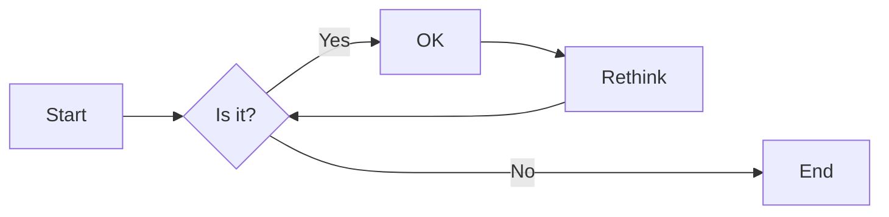
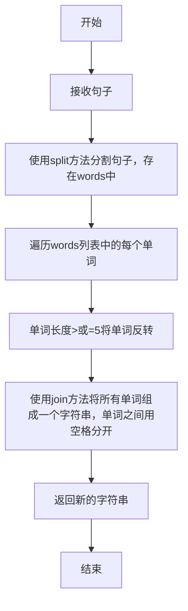
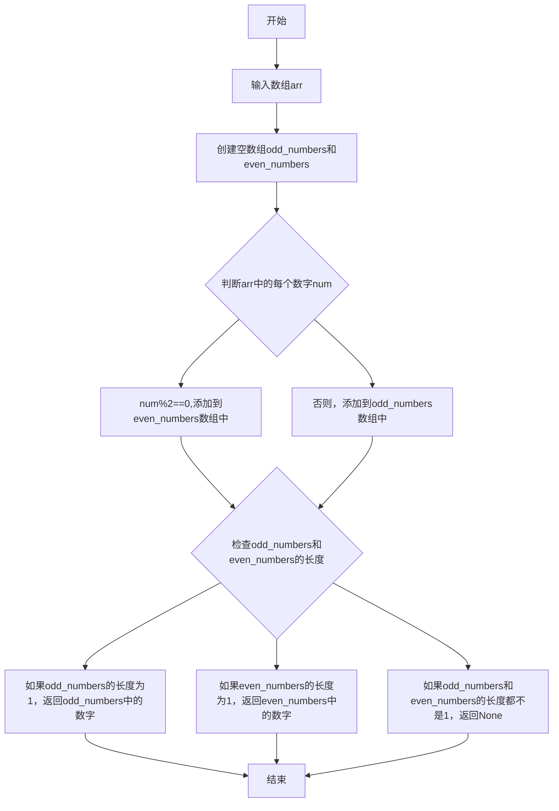
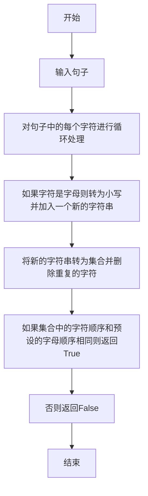
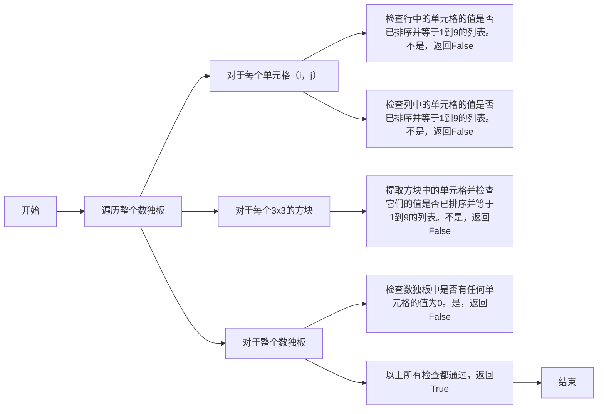
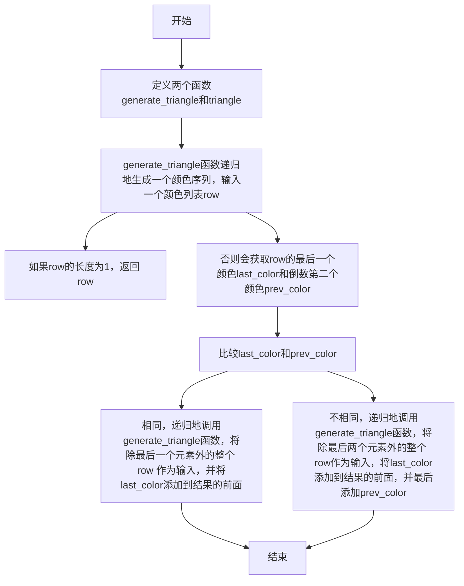

# 实验五 Python数据结构与数据模型

班级： 21计科2

学号： B20210302219

姓名： 罗天爱

Github地址：<https://github.com/linaliaa/lian_xi_2>

CodeWars地址：<https://www.codewars.com/users/linaliaa>

---

## 实验目的

1. 学习Python数据结构的高级用法
2. 学习Python的数据模型

## 实验环境

1. Git
2. Python 3.10
3. VSCode
4. VSCode插件

## 实验内容和步骤

### 第一部分

在[Codewars网站](https://www.codewars.com)注册账号，完成下列Kata挑战：

---

#### 第一题：停止逆转我的单词

难度： 6kyu

编写一个函数，接收一个或多个单词的字符串，并返回相同的字符串，但所有5个或更多的字母单词都是相反的（就像这个Kata的名字一样）。传入的字符串将只由字母和空格组成。只有当出现一个以上的单词时，才会包括空格。
例如：

```python
spinWords( "Hey fellow warriors" ) => returns "Hey wollef sroirraw" 
spinWords( "This is a test") => returns "This is a test" 
spinWords( "This is another test" )=> returns "This is rehtona test"
```

代码提交地址：
<https://www.codewars.com/kata/5264d2b162488dc400000001>

提示：

- 利用str的split方法可以将字符串分为单词列表
例如：

```python
words = "hey fellow warrior".split()
# words should be ['hey', 'fellow', 'warrior']
```

- 利用列表推导将长度大于等于5的单词反转(利用切片word[::-1])
- 最后使用str的join方法连结列表中的单词。

---

#### 第二题： 发现离群的数(Find The Parity Outlier)

难度：6kyu

给你一个包含整数的数组（其长度至少为3，但可能非常大）。该数组要么完全由奇数组成，要么完全由偶数组成，除了一个整数N。请写一个方法，以该数组为参数，返回这个 "离群 "的N。

例如：

```python
[2, 4, 0, 100, 4, 11, 2602, 36]
# Should return: 11 (the only odd number)

[160, 3, 1719, 19, 11, 13, -21]
# Should return: 160 (the only even number)
```

代码提交地址：
<https://www.codewars.com/kata/5526fc09a1bbd946250002dc>

---

#### 第三题： 检测Pangram

难度：6kyu

pangram是一个至少包含每个字母一次的句子。例如，"The quick brown fox jumps over the lazy dog "这个句子就是一个pangram，因为它至少使用了一次字母A-Z（大小写不相关）。

给定一个字符串，检测它是否是一个pangram。如果是则返回`True`，如果不是则返回`False`。忽略数字和标点符号。
代码提交地址：
<https://www.codewars.com/kata/545cedaa9943f7fe7b000048>

---

#### 第四题： 数独解决方案验证

难度：6kyu

数独背景

数独是一种在 9x9 网格上进行的游戏。游戏的目标是用 1 到 9 的数字填充网格的所有单元格，以便每一列、每一行和九个 3x3 子网格（也称为块）中的都包含数字 1 到 9。更多信息请访问：<http://en.wikipedia.org/wiki/Sudoku>

编写一个函数接受一个代表数独板的二维数组，如果它是一个有效的解决方案则返回 true，否则返回 false。数独板的单元格也可能包含 0，这将代表空单元格。包含一个或多个零的棋盘被认为是无效的解决方案。棋盘总是 9 x 9 格，每个格只包含 0 到 9 之间的整数。

代码提交地址：
<https://www.codewars.com/kata/63d1bac72de941033dbf87ae>

---

#### 第五题： 疯狂的彩色三角形

难度： 2kyu

一个彩色的三角形是由一排颜色组成的，每一排都是红色、绿色或蓝色。连续的几行，每一行都比上一行少一种颜色，是通过考虑前一行中的两个相接触的颜色而产生的。如果这些颜色是相同的，那么新的一行就使用相同的颜色。如果它们不同，则在新的一行中使用缺失的颜色。这个过程一直持续到最后一行，只有一种颜色被生成。

例如：

```python
Colour here:            G G        B G        R G        B R
Becomes colour here:     G          R          B          G
```

一个更大的三角形例子：

```python
R R G B R G B B
 R B R G B R B
  G G B R G G
   G R G B G
    B B R R
     B G R
      R B
       G
```

你将得到三角形的第一行字符串，你的工作是返回最后的颜色，这将出现在最下面一行的字符串。在上面的例子中，你将得到 "RRGBRGBB"，你应该返回 "G"。
限制条件： 1 <= length(row) <= 10 ** 5
输入的字符串将只包含大写字母'B'、'G'或'R'。

例如：

```python
triangle('B') == 'B'
triangle('GB') == 'R'
triangle('RRR') == 'R'
triangle('RGBG') == 'B'
triangle('RBRGBRB') == 'G'
triangle('RBRGBRBGGRRRBGBBBGG') == 'G'
```

代码提交地址：
<https://www.codewars.com/kata/5a331ea7ee1aae8f24000175>

提示：请参考下面的链接，利用三进制的特点来进行计算。
<https://stackoverflow.com/questions/53585022/three-colors-triangles>

---

### 第二部分

使用Mermaid绘制程序流程图

安装VSCode插件：

- Markdown Preview Mermaid Support
- Mermaid Markdown Syntax Highlighting

使用Markdown语法绘制你的程序绘制程序流程图（至少一个），Markdown代码如下：


显示效果如下：



查看Mermaid流程图语法-->[点击这里](https://mermaid.js.org/syntax/flowchart.html)

使用Markdown编辑器（例如VScode）编写本次实验的实验报告，包括[实验过程与结果](#实验过程与结果)、[实验考查](#实验考查)和[实验总结](#实验总结)，并将其导出为 **PDF格式** 来提交。

## 实验过程与结果

请将实验过程与结果放在这里，包括：

- [第一部分 Codewars Kata挑战](#第一部分)

### 第一题

```python
def spin_words(sentence):
    words = sentence.split()
    for i in range(len(words)):
        if len(words[i]) >= 5:
            words[i] = words[i][::-1]
    return ' '.join(words)
```

### 第二题

```python
def find_outlier(arr):  
    odd_numbers = []
    even_numbers = []
    for num in arr:
        if num % 2 == 0:
            even_numbers.append(num)  
        else:  
            odd_numbers.append(num)
    if len(odd_numbers) == 1:  
        return odd_numbers[0]  
    elif len(even_numbers) == 1:  
        return even_numbers[0]  
    else:  
        return None
```

### 第三题

```python
def is_pangram(sentence):
    sentence = ''.join(c.lower() for c in sentence if c.isalpha())
    return sorted(set(sentence)) == list('abcdefghijklmnopqrstuvwxyz')
```

### 第四题

```python
def validate_sudoku(board):
    for i in range(9):  
        if sorted(board[i]) != list(range(1, 10)):  
            return False
    for j in range(9):  
        if sorted([cell[j] for cell in board]) != list(range(1, 10)):  
            return False
    for block_row in range(0, 9, 3):  
        for block_col in range(0, 9, 3):  
            block = [board[x][y] for x in range(block_row, block_row + 3) for y in range(block_col, block_col + 3)]  
            if sorted(block) != list(range(1, 10)):  
                return False
    if any(cell == 0 for row in board for cell in row):  
        return False  
    return True
```

### 第五题

```python
def generate_triangle(row):  
    if len(row) == 1:  
        return row  
      
    last_color = row[-1]  
    prev_color = row[-2]  
      
    if last_color == prev_color:  
        return [last_color] + generate_triangle(row[:-1])  
    else:  
        return [last_color] + generate_triangle(row[:-2]) + [prev_color]
def triangle(row):  
    colors = generate_triangle(list(row))  
    return colors[-1]
```

- [第二部分 使用Mermaid绘制程序流程图](#第二部分)

第一题：停止逆转我的单词



第二题： 发现离群的数



第三题： 检测



第四题： 数独解决方案验证



第五题： 疯狂的彩色三角形



**注意：不要使用截图，因为Markdown文档转换为Pdf格式后，截图会无法显示。**

## 实验考查

请使用自己的语言并使用尽量简短代码示例回答下面的问题，这些问题将在实验检查时用于提问和答辩以及实际的操作。

1. 集合（set）类型有什么特点？它和列表（list）类型有什么区别？
答：集合（set）是一种无序且不重复的数据类型，它具有无序性、唯一性、不可变性、可哈希性。
与列表相比，列表是有序的，集合是无序的，列表是可变的，集合是不可变的，集合中的元素必须是唯一的，列表可以重复。

2. 集合（set）类型主要有那些操作？
答：添加元素：使用add()方法向集合中添加一个新元素。
删除元素：使用remove()方法从集合中删除一个元素。如果元素不存在于集合中，将引发KeyError异常。
成员检测：使用in关键字检查一个元素是否存在于集合中。
集合运算：使用union()、intersection()、difference()和symmetric_difference()方法进行集合运算，分别表示并集、交集、差集和对称差集。
迭代：集合是可以迭代的，可以使用for循环遍历集合中的元素。由于集合是无序的，迭代顺序也是不确定的。
转换为列表：使用list()函数将集合转换为列表。需要注意的是，转换后的列表顺序是不确定的，因为集合是无序的。
转换为字典：使用dict()函数将集合转换为字典，其中字典的键为集合中的元素，值为None。
检查集合是否为空：使用len()函数检查集合中元素的数量是否为0，以判断集合是否为空。
清空集合：使用clear()方法清空集合中的所有元素。
判断两个集合是否相等：使用==运算符比较两个集合是否相等。

3. 使用`*`操作符作用到列表上会产生什么效果？为什么不能使用`*`操作符作用到嵌套的列表上？使用简单的代码示例说明。
答：复制列表：当你对列表使用*操作符时，会返回该列表的一个复制品。

```python
list1 = [1, 2, 3]  
list2 = list1 * 2  #list2 现在是 [1, 2, 3, 1, 2, 3]
```

解包元组或列表：当你有一个元组或列表的列表，并且想要将它们解包到单个列表中时，可以使用*操作符。例如：

```python
tuple1 = (1, 2, 3)  
list1 = [4, 5, 6]  
list2 = list1 + tuple1  #list2 现在是 [4, 5, 6, 1, 2, 3]
```

乘法运算：当用于数字类型时，*操作符执行乘法运算。例如：

```python
num1 = 5  
num2 = 3  
result = num1 * num2  #result 是 15
```

不能直接将*操作符用于嵌套列表，因为这将尝试对列表进行重复操作，而不是对其元素进行操作。嵌套列表需要被解包（使用+操作符或extend()方法）或使用列表推导式等方式处理。

```python
nested_list = [[1, 2, 3], [4, 5, 6], [7, 8, 9]] 
flat_list = [item for sublist in nested_list for item in sublist]  #使用列表推导式展开嵌套列表  
print(flat_list)  #输出 [1, 2, 3, 4, 5, 6, 7, 8, 9]
```

4. 总结列表,集合，字典的解析（comprehension）的使用方法。使用简单的代码示例说明。
答：列表解析是创建新列表的一种非常简洁且高效的方式。它使用一个表达式在方括号内，后面跟随一个for循环，最后是一个可选的if子句。

例如，创建一个包含 0 到 9（含）所有偶数的列表：

```python
list_comp = [i for i in range(10) if i % 2 == 0]  
print(list_comp)  #输出：[0, 2, 4, 6, 8]
```

集合解析与列表解析非常相似，但结果是一个集合，而不是列表。集合是无序的，且不包含重复的元素。

例如，创建一个包含 0 到 9（含）所有偶数的集合：

```python
set_comp = {i for i in range(10) if i % 2 == 0}  
print(set_comp)  #输出：{0, 2, 4, 6, 8}
```

字典解析允许我们使用一个字典的键和值来创建一个新的字典。这在创建键值对映射时特别有用。

例如，创建一个字典，其键是 0 到 9（含）的偶数，值是对应数的平方：

```python
dict_comp = {i: i**2 for i in range(10) if i % 2 == 0}  
print(dict_comp)  #输出：{0: 0, 2: 4, 4: 16, 6: 36, 8: 64}
```

## 实验总结

总结一下这次实验你学习和使用到的知识，例如：编程工具的使用、数据结构、程序语言的语法、算法、编程技巧、编程思想。
答：这次的实验是学习Python数据结构的高级用法，学习Python的数据模型。在codewars上做题，让我对python的使用更加熟练，学习了一些新的知识。实验考查的问题我依靠了ai，有些问题对我来还有点困难，这次的实验对我更深入的学习python很有帮助。
