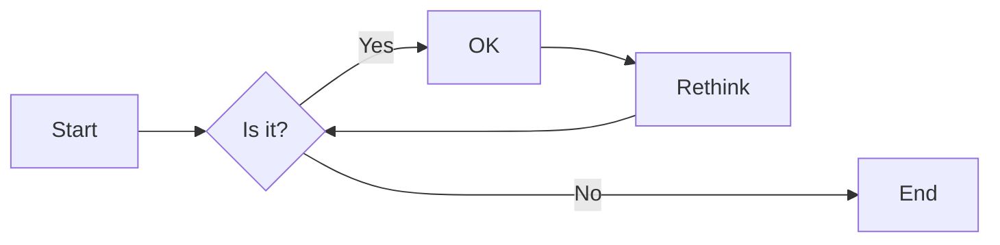
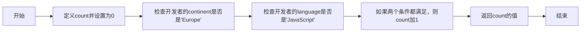
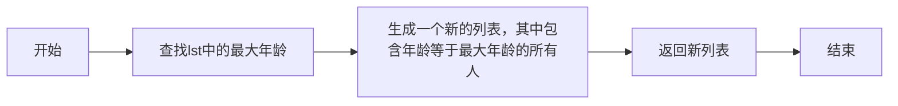

# 实验六 Python函数

班级： 21计科2

学号： B20210302219

姓名： 罗天爱

Github地址：<https://github.com/linaliaa/lian_xi_2>

CodeWars地址：<https://www.codewars.com/users/linaliaa>

---

## 实验目的

1. 学习Python函数的基本用法
2. 学习lambda函数和高阶函数的使用
3. 掌握函数式编程的概念和实践

## 实验环境

1. Git
2. Python 3.10
3. VSCode
4. VSCode插件

## 实验内容和步骤

### 第一部分

Python函数

完成教材《Python编程从入门到实践》下列章节的练习：

- 第8章 函数

---

### 第二部分

在[Codewars网站](https://www.codewars.com)注册账号，完成下列Kata挑战：

---

#### 第一题：编码聚会1

难度： 7kyu

你将得到一个字典数组，代表关于首次报名参加你所组织的编码聚会的开发者的数据。
你的任务是返回来自欧洲的JavaScript开发者的数量。
例如，给定以下列表：

```python
lst1 = [
  { 'firstName': 'Noah', 'lastName': 'M.', 'country': 'Switzerland', 'continent': 'Europe', 'age': 19, 'language': 'JavaScript' },
  { 'firstName': 'Maia', 'lastName': 'S.', 'country': 'Tahiti', 'continent': 'Oceania', 'age': 28, 'language': 'JavaScript' },
  { 'firstName': 'Shufen', 'lastName': 'L.', 'country': 'Taiwan', 'continent': 'Asia', 'age': 35, 'language': 'HTML' },
  { 'firstName': 'Sumayah', 'lastName': 'M.', 'country': 'Tajikistan', 'continent': 'Asia', 'age': 30, 'language': 'CSS' }
]
```

你的函数应该返回数字1。
如果，没有来自欧洲的JavaScript开发人员，那么你的函数应该返回0。

注意：
字符串的格式将总是"Europe"和"JavaScript"。
所有的数据将始终是有效的和统一的，如上面的例子。

这个卡塔是Coding Meetup系列的一部分，其中包括一些简短易行的卡塔，这些卡塔是为了让人们掌握高阶函数的使用。在Python中，这些方法包括：`filter`, `map`, `reduce`。当然也可以采用其他方法来解决这些卡塔。

[代码提交地址](https://www.codewars.com/kata/coding-meetup-number-1-higher-order-functions-series-count-the-number-of-javascript-developers-coming-from-europe)

---

#### 第二题： 使用函数进行计算

难度：5kyu

这次我们想用函数来写计算，并得到结果。让我们看一下一些例子：

```python
seven(times(five())) # must return 35
four(plus(nine())) # must return 13
eight(minus(three())) # must return 5
six(divided_by(two())) # must return 3
```

要求：

- 从0（"零"）到9（"九"）的每个数字都必须有一个函数。
- 必须有一个函数用于以下数学运算：加、减、乘、除。
- 每个计算都由一个操作和两个数字组成。
- 最外面的函数代表左边的操作数，最里面的函数代表右边的操作数。
- 除法应该是整数除法。

例如，下面的计算应该返回2，而不是2.666666...。

```python
eight(divided_by(three()))
```

代码提交地址：
<https://www.codewars.com/kata/525f3eda17c7cd9f9e000b39>

---

#### 第三题： 缩短数值的过滤器(Number Shortening Filter)

难度：6kyu

在这个kata中，我们将创建一个函数，它返回另一个缩短长数字的函数。给定一个初始值数组替换给定基数的 X 次方。如果返回函数的输入不是数字字符串，则应将输入本身作为字符串返回。

例子：

```python
filter1 = shorten_number(['','k','m'],1000)
filter1('234324') == '234k'
filter1('98234324') == '98m'
filter1([1,2,3]) == '[1,2,3]'
filter2 = shorten_number(['B','KB','MB','GB'],1024)
filter2('32') == '32B'
filter2('2100') == '2KB';
filter2('pippi') == 'pippi'
```

代码提交地址：
<https://www.codewars.com/kata/56b4af8ac6167012ec00006f>

---

#### 第四题： 编码聚会7

难度： 6kyu

您将获得一个对象序列，表示已注册参加您组织的下一个编程聚会的开发人员的数据。

您的任务是返回一个序列，其中包括最年长的开发人员。如果有多个开发人员年龄相同，则将他们按照在原始输入数组中出现的顺序列出。

例如，给定以下输入数组：

```python
list1 = [
  { 'firstName': 'Gabriel', 'lastName': 'X.', 'country': 'Monaco', 'continent': 'Europe', 'age': 49, 'language': 'PHP' },
  { 'firstName': 'Odval', 'lastName': 'F.', 'country': 'Mongolia', 'continent': 'Asia', 'age': 38, 'language': 'Python' },
  { 'firstName': 'Emilija', 'lastName': 'S.', 'country': 'Lithuania', 'continent': 'Europe', 'age': 19, 'language': 'Python' },
  { 'firstName': 'Sou', 'lastName': 'B.', 'country': 'Japan', 'continent': 'Asia', 'age': 49, 'language': 'PHP' },
]
```

您的程序应该返回如下结果：

```python
[
  { 'firstName': 'Gabriel', 'lastName': 'X.', 'country': 'Monaco', 'continent': 'Europe', 'age': 49, 'language': 'PHP' },
  { 'firstName': 'Sou', 'lastName': 'B.', 'country': 'Japan', 'continent': 'Asia', 'age': 49, 'language': 'PHP' },
]
```

注意：

- 输入的列表永远都包含像示例中一样有效的正确格式的数据，而且永远不会为空。

代码提交地址：
<https://www.codewars.com/kata/582887f7d04efdaae3000090>

---

#### 第五题： Currying versus partial application

难度： 4kyu

[Currying versus partial application](https://2ality.com/2011/09/currying-vs-part-eval.html)是将一个函数转换为具有更小arity(参数更少)的另一个函数的两种方法。虽然它们经常被混淆，但它们的工作方式是不同的。目标是学会区分它们。

Currying

是一种将接受多个参数的函数转换为以每个参数都只接受一个参数的一系列函数链的技术。

Currying接受一个函数：

```python
f：X × Y → R
```

并将其转换为一个函数：

```python
f'：X → (Y → R)
```

我们不再使用两个参数调用f，而是使用第一个参数调用f'。结果是一个函数，然后我们使用第二个参数调用该函数来产生结果。因此，如果非curried f被调用为：

```python
f(3, 5)
```

那么curried f'被调用为：

```python
f'(3)(5)
```

示例
给定以下函数：

```python
def add(x, y, z):
  return x + y + z
```

我们可以以普通方式调用：

```python
add(1, 2, 3) # => 6
```

但我们可以创建一个curried版本的add(a, b, c)函数：

```python
curriedAdd = lambda a: (lambda b: (lambda c: add(a,b,c)))
curriedAdd(1)(2)(3) # => 6
```

Partial application
是将一定数量的参数固定到函数中，从而产生另一个更小arity(参数更少)的函数的过程。

部分应用接受一个函数：

```python
f：X × Y → R
```

和一个固定值x作为第一个参数，以产生一个新的函数

```python
f'：Y → R
```

f'与f执行的操作相同，但只需要填写第二个参数，这就是其arity比f的arity少一个的原因。可以说第一个参数绑定到x。

示例:

```python
partialAdd = lambda a: (lambda *args: add(a,*args))
partialAdd(1)(2, 3) # => 6
```

你的任务是实现一个名为curryPartial()的通用函数，可以进行currying或部分应用。

例如：

```python
curriedAdd = curryPartial(add)
curriedAdd(1)(2)(3) # => 6

partialAdd = curryPartial(add, 1)
partialAdd(2, 3) # => 6
```

我们希望函数保持灵活性。

所有下面这些例子都应该产生相同的结果：

```python
curryPartial(add)(1)(2)(3) # =>6 
curryPartial(add, 1)(2)(3) # =>6 
curryPartial(add, 1)(2, 3) # =>6 
curryPartial(add, 1, 2)(3) # =>6 
curryPartial(add, 1, 2, 3) # =>6 
curryPartial(add)(1, 2, 3) # =>6 
curryPartial(add)(1, 2)(3) # =>6 
curryPartial(add)()(1, 2, 3) # =>6 
curryPartial(add)()(1)()()(2)(3) # =>6 

curryPartial(add)()(1)()()(2)(3, 4, 5, 6) # =>6 
curryPartial(add, 1)(2, 3, 4, 5) # =>6 

curryPartial(curryPartial(curryPartial(add, 1), 2), 3) # =>6
curryPartial(curryPartial(add, 1, 2), 3) # =>6
curryPartial(curryPartial(add, 1), 2, 3) # =>6
curryPartial(curryPartial(add, 1), 2)(3) # =>6
curryPartial(curryPartial(add, 1)(2), 3) # =>6
curryPartial(curryPartial(curryPartial(add, 1)), 2, 3) # =>6
```

代码提交地址：
<https://www.codewars.com/kata/53cf7e37e9876c35a60002c9>

---

### 第三部分

使用Mermaid绘制程序流程图

安装VSCode插件：

- Markdown Preview Mermaid Support
- Mermaid Markdown Syntax Highlighting

使用Markdown语法绘制你的程序绘制程序流程图（至少一个），Markdown代码如下：


显示效果如下：



查看Mermaid流程图语法-->[点击这里](https://mermaid.js.org/syntax/flowchart.html)

使用Markdown编辑器（例如VScode）编写本次实验的实验报告，包括[实验过程与结果](#实验过程与结果)、[实验考查](#实验考查)和[实验总结](#实验总结)，并将其导出为 **PDF格式** 来提交。

## 实验过程与结果

请将实验过程与结果放在这里，包括：

- [第一部分 Python函数](#第一部分)

练习 8.1：消息

```python
def display_message():
    print('本章的主题：def(函数)')
display_message()
```

练习 8.2：喜欢的书

```python
def favorite_book(title):
    print('One of my favorite books is: '+title)
favorite_book('Python编程')
```

练习 8.3：T恤

```python
def make_shirt(size,message):
    if message=='':
        print('尺寸为：'+size+'; 印花为：'+'空')
    else:
        print('尺寸为：'+size+'; 印花为：'+message)
make_shirt('XS','')
make_shirt('XXL',message='Hello Python!')
```

练习 8.4：大号T恤

```python
def make_shirt(size,message='I love Python'):
    print('尺寸为：'+size+'; 印花为：'+message)
make_shirt('大号T恤')
make_shirt('中号T恤')
make_shirt('小号T恤',message='Hello Python!')
```

练习 8.5：城市

```python
def describe_city(name,contry='China'):
    print(name+' is in '+contry)
describe_city('BeiJing')
describe_city('ShangHai')
describe_city('Florence','Italy')
```

练习 8.6：城市名

```python
def city_country(name,country):
    city_country1=name+','+country
    return city_country1
a=city_country('BeiJing','China')
b=city_country('ShangHai','China')
c=city_country('florence','Italy')
print(a)
print(b)
print(c)
```

练习 8.7：专辑

```python
def make_ablum(gsname,zjname,count=None):
    if count:
        k={'gsname':gsname,'zjname':zjname,'count':count}
    else:
        k={'gsname':gsname,'zjname':zjname}
    return k
a=make_ablum('A','a','1')
b=make_ablum('B','b')
c=make_ablum('C','c','3')
print(a)
print(b)
print(c)
```

练习 8.8：用户专辑

```python
def make_ablum(gsname,zjname,count=''):
    if count:
        k={'gsname':gsname,'zjname':zjname,'count':count}
    else:
        k={'gsname':gsname,'zjname':zjname}
    return k
k1='请输入歌手名：(输入quit退出)'
k2='请输入专辑名：(输入quit退出)'
ac=True
while ac:
    a=input(k1)
    b=input(k2)
    if a=='quit' or b=='quit':
        break
    else:
        c=make_ablum(a,b)
        print(c)
```

练习 8.9：消息

```python
message=['a','b','c']
def show_message():
    for name in message:
        print(name)
show_message()
```

练习 8.10：发送消息

```python
message=['a','b','c']
sent_messages=[]
def send_messages():
    for name in message:
        print(name)
        sent_messages.append(name)
send_messages()
print('message:',message)
print('sent_messages:',sent_messages)
```

练习 8.11：消息归档

```python
message=['a','b','c']
sent_messages=[]

def send_messages(messages):
    for name in messages:
        print(name)
        sent_messages.append(name)

message_copy = message.copy()
send_messages(message_copy)

print('message:', message)
print('sent_messages:', sent_messages)
```

练习 8.12：三明治

```python
def sandwich(*food):
    print('添加的食材有：')
    for i in food:
        print(i)

sandwich('a','b','c')
sandwich('d','e')
sandwich('f')
```

练习 8.13：用户简介

```python
def user_profile(first,last,**else_info):
    name_file={}
    name_file['first_name']=first
    name_file['last_name']=last
    for i,j in else_info.items():
        name_file[i]=j
    return name_file
a=user_profile('A','1',company='2',sex='3')
print(a)
b=user_profile('B','1',sex='2')
print(b)
```

练习 8.14：汽车

```python
def make_car(manufacture,type,**else_info):
    cars={}
    cars['manufacture']=manufacture
    cars['type']=type
    for i,j in else_info.items():
        cars[i]=j
    return cars

car=make_car('subaru','outback',color='blue',tow_package=True)
print(car)
```

- [第二部分 Codewars Kata挑战](#第二部分)

第一题：编码聚会1

```python
def count_developers(developers):  
    count = 0  
    for developer in developers:  
        if developer['continent'] == 'Europe' and developer['language'] == 'JavaScript':  
            count += 1  
    return count
```

第二题：使用函数进行计算

```python
def zero(fun=None): return fun(0) if fun else 0
def one(fun=None): return fun(1) if fun else 1
def two(fun=None): return fun(2) if fun else 2
def three(fun=None): return fun(3) if fun else 3
def four(fun=None): return fun(4) if fun else 4
def five(fun=None): return fun(5) if fun else 5
def six(fun=None): return fun(6) if fun else 6
def seven(fun=None): return fun(7) if fun else 7
def eight(fun=None): return fun(8) if fun else 8
def nine(fun=None): return fun(9) if fun else 9

def plus(y): return lambda x: x + y
def minus(y): return lambda x: x - y
def times(y): return lambda x: x * y
def divided_by(y): return lambda x: x // y
```

第三题：缩短数值的过滤器(Number Shortening Filter)

```python
def shorten_number(suffixes, base):
    def my_filter(data):
        try:
            number = int(data)
        except (TypeError, ValueError):
            return str(data)
        else:
            i = 0
            while number//base > 0 and i < len(suffixes)-1:
                number //= base
                i += 1
            return str(number) + suffixes[i]
    return my_filter
```

第四题：编码聚会7

```python
def find_senior(lst): 
    mage = max(a['age'] for a in lst)
    return [a for a in lst if a['age']==mage]
```

第五题：Currying versus partial application

```python
from inspect import signature
from functools import partial

def curry_partial(main_func, *args):
    
    if not(callable(main_func)):
        return main_func
    
    p = len(signature(main_func).parameters)
    func = partial(main_func)
    
    for a in args:
        if len(func.args) == p: break
        func = partial(func, a)
    
    if len(func.args) < p:
        return partial(curry_partial, main_func, *func.args)

    return func()
```

- [第三部分 使用Mermaid绘制程序流程图](#第三部分)

第一题：



第四题：



**注意：不要使用截图，Markdown文档转换为Pdf格式后，截图可能会无法显示。**

## 实验考查

请使用自己的语言并使用尽量简短代码示例回答下面的问题，这些问题将在实验检查时用于提问和答辩以及实际的操作。

1. 什么是函数式编程范式？
答：函数式编程是一种编程范式，它将计算过程视为一系列数学函数的求值。在函数式编程中，函数是一等公民，这意味着函数可以作为参数传递给其他函数，也可以作为其他函数的返回值。函数式编程的核心思想是通过组合纯函数（没有副作用的函数）来构建程序。

2. 什么是lambda函数？请举例说明。
答：Lambda函数是一种匿名函数，也就是没有名字的函数。它们主要用于短小的函数定义，而无需使用def关键字创建一个正式的函数。Lambda函数在Python中很常见，通常用于短小的匿名函数。lambda函数只能包含一个表达式，它们不能包含复杂的逻辑或多个语句。对于更复杂的需求，仍然需要使用传统的def关键字来定义函数。
示例：

```python
add = lambda x, y: x + y
print(add(2, 3)) #输出：5
```

3. 什么是高阶函数？常用的高阶函数有哪些？这些高阶函数如何工作？使用简单的代码示例说明。
答：高阶函数是接受一个或多个函数作为输入（参数）并/或返回一个函数作为输出的函数。换句话说，它是一个将函数作为参数的函数。在编程中，高阶函数可以极大的提高代码的复用性和灵活性。它们在许多编程语言中都有支持，例如Python、JavaScript、Java等。

以下是一些常见的高阶函数：
map()：这个函数接受两个参数，一个是函数，一个是可迭代对象。它会将函数应用到可迭代对象的每一个元素，并返回一个新的迭代器。

```python
def square(x):
    return x * x
numbers = [1, 2, 3, 4, 5]
squared = map(square, numbers)
print(list(squared))  #输出：[1, 4, 9, 16, 25]
```

filter()：这个函数接受两个参数，一个是函数，一个是可迭代对象。它只会返回那些使得函数返回值为True的元素。

```python
def is_even(x):
    return x % 2 == 0
numbers = [1, 2, 3, 4, 5]
even_numbers = filter(is_even, numbers)
print(list(even_numbers))  #输出：[2, 4]
```

reduce()：这个函数接受两个参数，一个是函数，一个是可迭代对象。它会将函数应用到可迭代对象的每一对元素上，从而把可迭代对象转化成一个单一的输出。

```python
from functools import reduce  
import operator  
numbers = [1, 2, 3, 4, 5]  
sum = reduce(operator.add, numbers)  
print(sum)  # 输出：15
```

以上这些高阶函数的工作方式就是将用户提供的函数和可迭代对象的每一个元素或者对对元素组合起来进行处理，最后返回处理后的结果。

## 实验总结

总结一下这次实验你学习和使用到的知识，例如：编程工具的使用、数据结构、程序语言的语法、算法、编程技巧、编程思想。
答：这次的实验，首先学习了如何编写函数，以及如何传递实参，让函数能够访问完成工作所需的信息；然后学习了如何使用位置实参和关键字实参，以及如何接受任意数量的实参。也知道了显示输出的函数和返回值的函数，如何将函数与列表、字典、if语句和while循环结合起来使用，如何将函数存储在称为模块的独立文件中，让程序文件更简单、更易于理解；最后，了解了函数编写指南，遵循这些指南可让程序始终保持良好的结构。
完成了五个codewars题目，其中有几个有一些困难，纠正几次都通不过，最后查看老师的文件才找到解决办法。这次的实验让我对python有了更多的了解！
