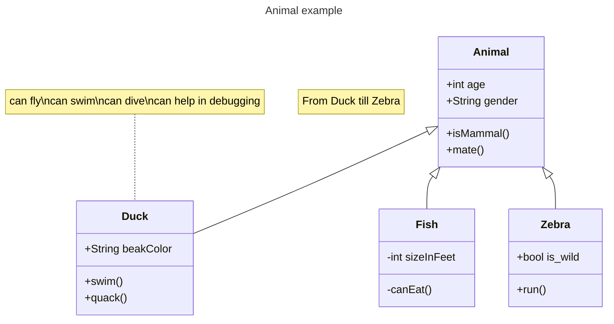
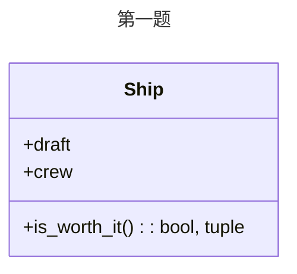
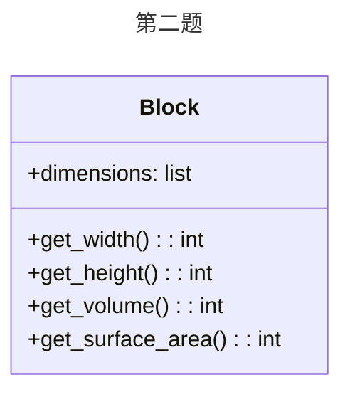

# 实验七 Python面向对象编程

班级： 21计科2

学号： B20210302219

姓名： 罗天爱

Github地址：<https://github.com/linaliaa/lian_xi_2>

CodeWars地址：<https://www.codewars.com/users/linaliaa>

---

## 实验目的

1. 学习Python类和继承的基础知识
2. 学习namedtuple和DataClass的使用

## 实验环境

1. Git
2. Python 3.10
3. VSCode
4. VSCode插件

## 实验内容和步骤

### 第一部分

Python面向对象编程

完成教材《Python编程从入门到实践》下列章节的练习：

- 第9章 类

---

### 第二部分

在[Codewars网站](https://www.codewars.com)注册账号，完成下列Kata挑战：

---

#### 第一题：面向对象的海盗

难度： 8kyu

啊哈，伙计!

你是一个小海盗团的首领。而且你有一个计划。在OOP的帮助下，你希望建立一个相当有效的系统来识别船上有大量战利品的船只。
对你来说，不幸的是，现在的人很重，那么你怎么知道一艘船上装的是黄金而不是人呢？

你首先要写一个通用的船舶类。

```python
class Ship:
    def __init__(self, draft, crew):
        self.draft = draft
        self.crew = crew
```

每当你的间谍看到一艘新船进入码头，他们将根据观察结果创建一个新的船舶对象。

- `draft`吃水 - 根据船在水中的高度来估计它的重量
- `crew`船员 - 船上船员的数量

`Titanic = Ship(15, 10)`

任务

你可以访问船舶的 "draft(吃水) "和 "crew(船员)"。"draft(吃水) "是船的总重量，"船员 "是船上的人数。
每个船员都会给船的吃水增加1.5个单位。如果除去船员的重量后，吃水仍然超过20，那么这艘船就值得掠夺。任何有这么重的船一定有很多战利品!
添加方法
`is_worth_it`
来决定这艘船是否值得掠夺。

例如：

```python
Titanic.is_worth_it()
False
```

祝你好运，愿你能找到金子!

代码提交地址：
<https://www.codewars.com/kata/54fe05c4762e2e3047000add>

---

#### 第二题： 搭建积木

难度：7kyu

写一个创建Block的类（Duh.）
构造函数应该接受一个数组作为参数，这个数组将包含3个整数，其形式为`[width, length, height]`，Block应该由这些整数创建。

定义这些方法:

- `get_width()` return the width of the `Block`
- `get_length()` return the length of the `Block`
- `get_height()` return the height of the `Block`
- `get_volume()` return the volume of the `Block`
- `get_surface_area()` return the surface area of the `Block`

例子：

```python
b = Block([2,4,6]) # create a `Block` object with a width of `2` a length of `4` and a height of `6`
b.get_width() # return 2    
b.get_length() # return 4
b.get_height() # return 6
b.get_volume() # return 48
b.get_surface_area() # return 88
```

注意： 不需要检查错误的参数。

代码提交地址：
<https://www.codewars.com/kata/55b75fcf67e558d3750000a3>

---

#### 第三题： 分页助手

难度：5kyu

在这个练习中，你将加强对分页的掌握。你将完成PaginationHelper类，这是一个实用类，有助于查询与数组有关的分页信息。
该类被设计成接收一个值的数组和一个整数，表示每页允许多少个项目。集合/数组中包含的值的类型并不相关。

下面是一些关于如何使用这个类的例子：

```python
helper = PaginationHelper(['a','b','c','d','e','f'], 4)
helper.page_count() # should == 2
helper.item_count() # should == 6
helper.page_item_count(0)  # should == 4
helper.page_item_count(1) # last page - should == 2
helper.page_item_count(2) # should == -1 since the page is invalid

# page_index takes an item index and returns the page that it belongs on
helper.page_index(5) # should == 1 (zero based index)
helper.page_index(2) # should == 0
helper.page_index(20) # should == -1
helper.page_index(-10) # should == -1 because negative indexes are invalid
```

代码提交地址：
<https://www.codewars.com/kata/515bb423de843ea99400000a>

---

#### 第四题： 向量（Vector）类

难度： 5kyu

创建一个支持加法、减法、点积和向量长度的向量（Vector）类。

举例来说：

```python
a = Vector([1, 2, 3])
b = Vector([3, 4, 5])
c = Vector([5, 6, 7, 8])

a.add(b)      # should return a new Vector([4, 6, 8])
a.subtract(b) # should return a new Vector([-2, -2, -2])
a.dot(b)      # should return 1*3 + 2*4 + 3*5 = 26
a.norm()      # should return sqrt(1^2 + 2^2 + 3^2) = sqrt(14)
a.add(c)      # raises an exception
```

如果你试图对两个不同长度的向量进行加减或点缀，你必须抛出一个错误。
向量类还应该提供：

- 一个 `__str__` 方法，这样 `str(a) === '(1,2,3)'`
- 一个equals方法，用来检查两个具有相同成分的向量是否相等。

注意：测试案例将利用用户提供的equals方法。

代码提交地址：
<https://www.codewars.com/kata/526dad7f8c0eb5c4640000a4>

---

#### 第五题： Codewars风格的等级系统

难度： 4kyu

编写一个名为User的类，用于计算用户在类似于Codewars使用的排名系统中的进步量。

业务规则：

- 一个用户从等级-8开始，可以一直进步到8。
- 没有0（零）等级。在-1之后的下一个等级是1。
- 用户将完成活动。这些活动也有等级。
- 每当用户完成一个有等级的活动，用户的等级进度就会根据活动的等级进行更新。
- 完成活动获得的进度是相对于用户当前的等级与活动的等级而言的。
- 用户的等级进度从零开始，每当进度达到100时，用户的等级就会升级到下一个等级。
- 在上一等级时获得的任何剩余进度都将被应用于下一等级的进度（我们不会丢弃任何进度）。例外的情况是，如果没有其他等级的进展（一旦你达到8级，就没有更多的进展了）。
- 一个用户不能超过8级。
- 唯一可接受的等级值范围是-8,-7,-6,-5,-4,-3,-2,-1,1,2,3,4,5,6,7,8。任何其他的值都应该引起错误。

逻辑案例：

- 如果一个排名为-8的用户完成了一个排名为-7的活动，他们将获得10的进度。
- 如果一个排名为-8的用户完成了排名为-6的活动，他们将获得40的进展。
- 如果一个排名为-8的用户完成了排名为-5的活动，他们将获得90的进展。
- 如果一个排名-8的用户完成了排名-4的活动，他们将获得160个进度，从而使该用户升级到排名-7，并获得60个进度以获得下一个排名。
- 如果一个等级为-1的用户完成了一个等级为1的活动，他们将获得10个进度（记住，零等级会被忽略）。

代码案例：

```python
user = User()
user.rank # => -8
user.progress # => 0
user.inc_progress(-7)
user.progress # => 10
user.inc_progress(-5) # will add 90 progress
user.progress # => 0 # progress is now zero
user.rank # => -7 # rank was upgraded to -7
```

代码提交地址：
<https://www.codewars.com/kata/51fda2d95d6efda45e00004e>

---

### 第三部分

使用Mermaid绘制程序的**类图**

安装VSCode插件：

- Markdown Preview Mermaid Support
- Mermaid Markdown Syntax Highlighting

使用Markdown语法绘制你的程序绘制程序类图（至少一个），Markdown代码如下：


显示效果如下：



查看Mermaid类图的语法-->[点击这里](https://mermaid.js.org/syntax/classDiagram.html)

使用Markdown编辑器（例如VScode）编写本次实验的实验报告，包括[实验过程与结果](#实验过程与结果)、[实验考查](#实验考查)和[实验总结](#实验总结)，并将其导出为 **PDF格式** 来提交。

## 实验过程与结果

请将实验过程与结果放在这里，包括：

- [第一部分 Python面向对象编程](#第一部分)

练习 9.1：餐馆

```python
class Restaurant:
    def __init__(self,restaurant_name,cuisine_type):
        self.restaurant_name = restaurant_name
        self.cuisine_type = cuisine_type
    def describe_restaurant(self):
        print(self.restaurant_name)
        print(self.cuisine_type)
    def open_restaurant(self):
        print('Restaurant is open')
restaurant = Restaurant('A','B')
print(restaurant.restaurant_name,'',restaurant.cuisine_type)
restaurant.describe_restaurant()
restaurant.open_restaurant()
```

练习 9.2：三家餐馆

```python
class Restaurant:
    def __init__(self,restaurant_name,cuisine_type):
        self.restaurant_name = restaurant_name
        self.cuisine_type = cuisine_type
    def describe_restaurant(self):
        print(self.restaurant_name)
        print(self.cuisine_type)
    def open_restaurant(self):
        print('Restaurant is open')
r1=Restaurant('A1','B1')
r1.describe_restaurant()
r2=Restaurant('A2','B2')
r2.describe_restaurant()
r3=Restaurant('A3','B3')
r3.describe_restaurant()
```

练习 9.3：用户

```python
class User():
    def __init__(self, first_name,last_name):
        self.first_name = first_name
        self.last_name = last_name
    def describe_user(self):
        print('用户：' + self.first_name + self.last_name)
    def greet_user(self):
        print('你好！ ' + self.first_name + self.last_name)
user_a = User('A','a')
user_b = User('B','b')
user_c = User('C','c')
user_a.describe_user()
user_b.describe_user()
user_c.describe_user()
user_a.greet_user()
user_b.greet_user()
user_c.greet_user()
```

练习 9.4：就餐人数

```python
class Restaurant():
    def __init__(self,restaurant_name,cuisine_type):
        self.restaurant_name = restaurant_name
        self.cuisine_type = cuisine_type
        self.number_served = 1
    def describe_restaurant(self):
        print(self.restaurant_name)
        print(self.cuisine_type)
    def open_restaurant(self):
        print('Restaurant is open')
    def number_served_info(self):
        print('[' + self.restaurant_name + '] 餐馆每天可能接待的就餐人数: ' + str(self.number_served))
        print('来 [' + self.restaurant_name + '] 吃 [' + self.cuisine_type + '] 的人有：'+str(self.number_served)+' 人！')
    def set_number_served(self,number_info):
        self.number_served = number_info
    def increment_number_served(self,name_add):
        self.number_served += name_add
        
restaurant = Restaurant('A','b')
restaurant.number_served = 30
restaurant.set_number_served(0)
restaurant.increment_number_served(100)
restaurant.increment_number_served(10)
restaurant.increment_number_served(100)
restaurant.number_served_info()
```

练习 9.5：尝试登录次数

```python
class User():
    def __init__(self, first_name, last_name):
        self.first_name = first_name
        self.last_name = last_name
        self.login_attempts = 0
    def describe_user(self):#打印用户名称方法
        print('用户名称为：' + self.first_name + self.last_name)
        print('共登录用户量：(重置中……)'+str(self.login_attempts))
    def greet_user(self):#打印问候
        print('你好！ ' + self.first_name + self.last_name)
    def increment_login_attempts(self,number):
        self.login_attempts += number
        print('共登录用户量：' + str(self.login_attempts))
    def reset_login_attempts(self):
        self.login_attempts = 0
user_a = User('A','a')
user_a.increment_login_attempts(1)
user_a.increment_login_attempts(1)
user_a.increment_login_attempts(1)
user_a.reset_login_attempts()
user_a.describe_user()
```

练习 9.6：冰激凌小店

```python
class Restaurant():
    def __init__(self,restaurant_name,cuisine_type):
        self.restaurant_name = restaurant_name
        self.cuisine_type = cuisine_type
    def describe_restaurant(self):
        print(self.restaurant_name)
        print(self.cuisine_type)
    def open_restaurant(self):
        print('Restaurant is open')
class IceCreamStand(Restaurant):
    def __init__(self,restaurant_name,cuisine_type):
        super().__init__(restaurant_name,cuisine_type)
        self.favorite = ['1','2']
    def show_ice(self):
        for i in self.favorite:
            print(i)
            
IceCreamStand1 = IceCreamStand('A','a')
IceCreamStand1.show_ice()
```

练习 9.7：管理员

```python
class User():
    def __init__(self, first_name,last_name):
        self.first_name = first_name
        self.last_name = last_name
    def describe_user(self):
        print('用户名称为：' + self.first_name + self.last_name)
    def greet_user(self):
        print('你好！ ' + self.first_name + self.last_name)
        
class Admin(User):
    def __init__(self,first_name,last_name):
        super().__init__(first_name,last_name)
        self.privileges = ['can add post','can del post','can ban user']
    def show_privileges(self):
        for i in self.privileges:
            print("管理员权限有：" + i)
Admin1 = Admin('A','a')
Admin1.show_privileges()
```

练习 9.8：权限

```python
class User():
    def __init__(self, first_name,last_name):
        self.first_name = first_name
        self.last_name = last_name
    def describe_user(self):
        print('用户名称为：' + self.first_name + self.last_name)
    def greet_user(self):
        print('你好！ ' + self.first_name + self.last_name)
        
class Admin(User):
    def __init__(self,first_name,last_name):
        super().__init__(first_name,last_name)
        self.b=Privileges()
class Privileges():
    def __init__(self):
        self.privileges = ['can add post','can del post','can ban user']
    def show_privileges(self):
        for i in self.privileges:
            print("管理员权限有：" + i)

Admin1 = Admin('A','a')
Admin1.b.show_privileges()
```

练习 9.9：电池升级

```python
class Car():
    def __init__(self, make, model, year):
        self.make = make
        self.model = model
        self.year = year
        self.odometer_reading = 0
    def get_descriptive_name(self):
        long_name = str(self.year) + ' ' + self.make + ' ' + self.model
        return long_name
    def read_odometer(self):
        print("This car has " + str(self.odometer_reading) + " miles on it.")
    def update_odometer(self, milegeage):
        if milegeage >= self.odometer_reading:
            self.odometer_reading = milegeage
        else:
            print("You can't roll back an odometer!")
    def increment_odometer(self, miles):
        self.odometer_reading += miles
        
class Battery():
    def __init__(self, battery_size=70):
        self.battery_size = battery_size
    def describe_battery(self):
        print("This car has a " + str(self.battery_size) + "-kWh battery")
    def upgrade_battery(self):
        if self.battery_size != 85:
            self.battery_size = 85
    def get_range(self):
        if self.battery_size == 70:
            range = 240
        elif self.battery_size == 85:
            range = 270
        message = "This car can go approximately " + str(range)
        message += "miles on a full charge."
        print(message)
        self.upgrade_battery()

class ElectricCar(Car):
    def __init__(self, make, model, year):
        super().__init__(make, model, year)
        self.battery_size = Battery()
    def describe_battery(self):
        self.battery_size.battery_size()
    def get_range(self):
        self.battery_size.get_range()
my_tesla = ElectricCar('tesla', 'model s', 2016)
my_tesla.get_range()
my_tesla.get_range()
```

- [第二部分 Codewars Kata挑战](#第二部分)

第一题：面向对象的海盗

```python
class Ship:
    def __init__(self, draft, crew):
        self.draft = draft
        self.crew = crew
    def is_worth_it(self):
        total_crew_weight = self.crew * 1.5
        adjusted_draft = self.draft - total_crew_weight 
        return adjusted_draft > 20
```

第二题：搭建积木

```python
class Block:
    def __init__(self, dimensions):
        self.dimensions = dimensions
    def get_width(self):
        return self.dimensions[0]
    def get_length(self):
        return self.dimensions[1]
    def get_height(self):
        return self.dimensions[2]
    def get_volume(self):
        return self.dimensions[0] * self.dimensions[1] * self.dimensions[2]
    def get_surface_area(self):
        width = self.get_width()
        length = self.get_length()
        height = self.get_height()
        return 2 * (width * length + width * height + length * height)
```

第三题：分页助手

```python
# TODO: complete this class
class PaginationHelper:
    
    # The constructor takes in an array of items and an integer indicating
    # how many items fit within a single page
    def __init__(self, collection, items_per_page):
        self.collection=collection
        self.items_per_page=items_per_page
        pass
    
    # returns the number of items within the entire collection
    def item_count(self):
        return len(self.collection)
        pass
    
    # returns the number of pages
    def page_count(self):
        a=self.item_count()
        b=a/self.items_per_page
        if a%self.items_per_page!=0:
            b=b+1
        return int(b)
        pass
    
    # returns the number of items on the given page. page_index is zero based
    # this method should return -1 for page_index values that are out of range
    def page_item_count(self, page_index):        
        if page_index>self.page_count()-1 or page_index<0:
            return -1
        if page_index==self.page_count()-1:
            if self.item_count()==self.items_per_page:
                return self.items_per_page
            if self.items_per_page==1:
                return self.items_per_page
            if self.item_count()%self.items_per_page==0:
                return self.items_per_page
            return self.item_count()%self.items_per_page
        
        if page_index<self.page_count()-1:
            return self.items_per_page
        pass
    
    # determines what page an item at the given index is on. Zero based indexes.
    # this method should return -1 for item_index values that are out of range
    def page_index(self, item_index):
        if (item_index+1)>self.item_count() or item_index<0:
            return -1
        else:
            a=(item_index+1)/self.items_per_page-1
            if (item_index+1)%self.items_per_page!=0:
                a=a+1
        return int(a)
        pass
```

第四题：向量类

```python
import math  
class Vector:
    def __init__(self, components):
        self.components = list(components)
        
    def add(self, other):
        if len(self.components) != len(other.components):
            raise ValueError("Vectors must be of the same length to be added.")
        return Vector([x + y for x, y in zip(self.components, other.components)])
    
    def subtract(self, other):
        if len(self.components) != len(other.components):
            raise ValueError("Vectors must be of the same length to be subtracted.")
        return Vector([x - y for x, y in zip(self.components, other.components)])
    
    def dot(self, other):
        if len(self.components) != len(other.components):
            raise ValueError("Vectors must be of the same length to dot product.")
        return sum([self.components[i] * other.components[i] for i in range(len(self.components))])
    
    def norm(self):
        return math.sqrt(sum([x ** 2 for x in self.components]))
    
    def __str__(self):
        return "(" + ",".join(str(x) for x in self.components) + ")"
    
    def equals(self, other):
        if isinstance(other, Vector):
            return self.components == other.components
        return False
```

第五题：codewars风格的等级系统

```python
# TODO: create the User class
# it must support rank, progress, and the inc_progress(rank) method
class User ():    
    def __init__ (self):
        self.RANKS = [-8, -7, -6, -5, -4, -3, -2, -1, 1, 2, 3, 4, 5, 6, 7, 8]
        self.rank = -8
        self.rank_index = 0
        self.progress = 0
        
    def inc_progress (self, rank):
        rank_index = self.RANKS.index(rank)
        
        # 计算rank的差，得出可以获得多少进度
        if(self.rank!=8):
        # 完成的是同等级的题目
            if rank_index == self.rank_index:
                self.progress += 3

            # 完成的是比当前等级低一级的题目
            elif rank_index == self.rank_index - 1:
                self.progress += 1

            # 完成的是比当前等级高的题目
            elif rank_index > self.rank_index:
                difference = rank_index - self.rank_index
                self.progress += 10 * difference * difference

            # 如果进度大于100，升级，每减去100进度，升一级    
            while self.progress >= 100:
                self.rank_index += 1
                self.rank = self.RANKS[self.rank_index]
                self.progress -= 100    

                # 如果升到8级（最高级），进度被置为0
                if self.rank == 8:
                    self.progress = 0
                    return
```

- [第三部分 使用Mermaid绘制程序流程图](#第三部分)

第一题：



第二题：



注意代码需要使用markdown的代码块格式化，例如Git命令行语句应该使用下面的格式：


显示效果如下：

```bash
git init
git add .
git status
git commit -m "first commit"
```

如果是Python代码，应该使用下面代码块格式，例如：


显示效果如下：

```python
def add_binary(a,b):
    return bin(a+b)[2:]
```

代码运行结果的文本可以直接粘贴在这里。

**注意：不要使用截图，Markdown文档转换为Pdf格式后，截图可能会无法显示。**

## 实验考查

请使用自己的语言并使用尽量简短代码示例回答下面的问题，这些问题将在实验检查时用于提问和答辩以及实际的操作。

1. Python的类中__init__方法起什么作用？
答：__init__是一个特殊方法，被称为类的构造函数或初始化方法。当创建类的新实例时，__init__方法会自动被调用。它通常用于初始化新创建对象的属性。

2. Python语言中如何继承父类和改写（override）父类的方法。
答：继承是面向对象编程的重要特性之一，它允许子类从父类中获取属性和方法。当子类想要改写父类的方法时，可以使用super()函数来调用父类的方法，以便在子类中对其进行改写。

3. Python类有那些特殊的方法？它们的作用是什么？请举三个例子并编写简单的代码说明。
答：Python类有很多特殊的方法，这些方法以双下划线开头和结尾，例如__init__和__str__和__del__等。这些特殊方法在Python中被称为魔法方法或者双下划线方法。它们可以改变类的行为或者提供类的额外功能。

例如__init__(self, [args...])：这是类的构造方法，用于初始化新创建的对象。当创建一个类的新实例时，__init__方法会自动被调用。

```python
class MyClass:  
    def __init__(self, name):  
        self.name = name  

# 创建一个新的实例  
obj = MyClass('John')  
# 输出: John  
print(obj.name)
```

例如__str__(self)：这个方法返回对象的字符串表示。默认情况下，它会返回对象的类名和其在内存中的地址。但是，我们通常会重写这个方法以提供更有用的信息。

```python
class MyClass:  
    def __str__(self):  
        return 'My name is ' + self.name  
  
obj = MyClass('John')  
# 输出: My name is John  
print(obj)
```

例如__del__(self)：这是析构函数，当对象被销毁时自动调用。通常用于清理资源，例如关闭文件、网络连接等。需要注意的是，Python的垃圾收集机制并不能保证__del__方法一定会被调用，所以不应该过度依赖这个方法。

```python
class MyClass:  
    def __del__(self):  
        print('Object is being deleted')  
  
obj = MyClass()  
# 删除对象  
del obj  
# 输出: Object is being deleted
```

除了这些，Python还有很多其他的特殊方法，例如__len__以及__getitem__、__setitem__等，可以用来改变类的行为或者提供额外的功能。

## 实验总结

总结一下这次实验你学习和使用到的知识，例如：编程工具的使用、数据结构、程序语言的语法、算法、编程技巧、编程思想。

答：在这次的实验学习中，我先学习了如何编写类，如何使用属性在类中存储信息，如何编写方法让类具备所需的行为。学习了如何编写__init__()方法，知道了如何直接修改以及通过方法修改实例的属性，了解到使用继承可简化相关类的创建工作，将一个类的实例用作另一个类的属性能让类更简洁。通过将类存储在模块中，在需要使用这些类的文件中导入他们，可让项目变得整洁。

在做教材中的题目时，发现难度变大了，需要的代码更多了，这对我来说有一定的困难，需要花更多的时间来理解和学习。这次codewars的题目也变得更加艰难，有时候怎么改都不对，最后在网上寻找以及室友的帮助下才完成。总之，这是一个很有挑战的实验，让我学到了很多，对python的了解更进一步。
